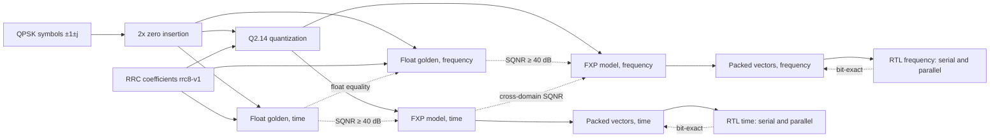
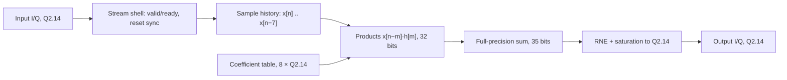
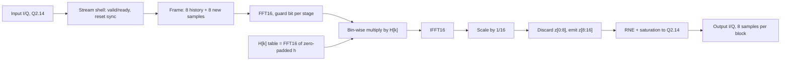

# System Block Diagram

Ticket: [#76](https://github.com/iledesma08/qpsk-rrc-filter-time-frequency/issues/76) (T52)

Map: [#12](https://github.com/iledesma08/qpsk-rrc-filter-time-frequency/issues/12)

Date: 2026-10-06

Status: candidate for team review. It records accepted decisions only and
introduces none. The normative values live in the contracts cited per stage.

Scope: the complete processing and verification chain requested by the
revised assignment: QPSK stimulus, time-domain filter (8-tap FIR) and
frequency-domain filter (block processing with 50% overlap), their float and
fixed-point models, the RTL versions and every comparison between them.

## 1. System and Verification View

Solid arrows carry data. Dotted arrows are comparisons; section 4.11 gives
their criteria.

## 2. Time-Domain Datapath

The same real coefficients filter I and Q. Serial `S=1` uses one shared MAC
over eight cycles (`II=8`); the systolic `S4P1`/`S8P1` variants use four or
eight tap PEs (`II=2`/`II=1`).

## 3. Frequency-Domain Datapath

One complex FFT over `I + jQ` filters both components at once. The serial
version is `U=1`; the optimized architecture is pending (section 5).

## 4. Stage Descriptions

### 4.1 QPSK symbols

- Generates a deterministic 1024-symbol frame of unnormalized QPSK corners
  `±1±j` (`Es=2`).
- The first 40 symbols are five fixed 8-symbol edge patterns: all four
  corners twice, diagonal alternation, I-only flips, Q-only flips and a
  constant corner. The remaining 984 symbols come from
  `numpy.random.default_rng(2026)` with Gray mapping
  (`00 -> +1+j`, `01 -> +1-j`, `10 -> -1+j`, `11 -> -1-j`).
- Three extra deterministic `sys_corners` frames of the same length stress
  the datapath: `corner_repeat`, `max_alternation` and
  `single_symbol_perturbation`.
- Source: `sim/python/stimulus.py`; `docs/contracts/qpsk-stimulus-15.md`.

### 4.2 2x zero insertion

- Places each symbol at an even sample index and a zero at the next odd
  index: `x[2k] = s[k]`, `x[2k+1] = 0`, giving 2048 samples.
- Filter history starts at zero; there are no guard symbols.
- Source: `sim/python/stimulus.py`; `qpsk-stimulus-15.md` D4-D5.

### 4.3 RRC coefficients

- Samples the root-raised-cosine pulse with roll-off `α=0.5` on the centered
  grid `t[n] = (n − 3.5)/2` symbol periods, `n = 0..7`, handling its singular
  points explicitly.
- Normalizes to unit discrete energy, `sum(h²) = 1`. The even length gives a
  linear-phase delay of 3.5 samples.
- The frozen artifact `rrc8-v1` is the single source for both domains; it is
  loaded with `load_rrc8_coefficients()` and never recomputed inline.
- Source: `sim/python/rrc_coefs.py`; `docs/contracts/rrc-coefficient-contract-13.md`.

### 4.4 Float golden, time

- Computes the full causal convolution `y[n] = sum(m=0..7) h[m]·x[n−m]` in
  float64.
- Output: 2055 samples (2048 + 7 tail samples), indices `0..2054`.
- Source: `sim/python/golden_time.py` (T11).

### 4.5 Float golden, frequency

- Overlap-save with forced 50% overlap: frame `b` is
  `x[8b−8 .. 8b+7]` (8 history + 8 new samples, 8 zeros before the first
  frame).
- Each frame goes through a complex FFT16, a bin-wise multiply by
  `H[k] = FFT16(h zero-padded to 16)` and an IFFT16 with the NumPy `1/N`
  convention.
- The first eight IFFT outputs are discarded (seven are time-aliased, the
  eighth duplicates the previous block) and `z[8:16]` becomes `y[8b .. 8b+7]`.
- 257 blocks cover the frame and its tail. The result equals the time golden
  over all 2055 samples.
- Source: `sim/python/golden_freq.py` (T12);
  `docs/contracts/frequency-block-contract-14.md` D1, confirmed by the revised
  assignment.

### 4.6 Q2.14 quantization

- Converts input samples and coefficients to signed `Q2.14` (`W=16`, 14
  fractional bits) with round-half-to-even (RNE).
- `±1` inputs are exact. The coefficient integers are
  `[179, −1818, 1818, 11295, 11295, 1818, −1818, 179]`; T22 exports the
  validated production table.
- Saturation happens only at explicit narrowing boundaries; internal overflow
  fails the candidate.
- Source: `docs/contracts/fxp-policy-16.md` D2-D3 (T20).

### 4.7 FXP model and RTL, time

- Multiplies each history sample by its coefficient (32-bit products, 28
  fractional bits) and adds the eight products at full precision in a 35-bit
  accumulator (`2W+3`).
- Rounds once, after the eight-term sum, with RNE and saturation to `Q2.14`.
- RTL versions: serial `T-serial` (`S=1`, one MAC, `II=8`) and systolic
  `T-S4P1`/`T-S8P1` (`II=2`/`II=1`). All variants share one numeric policy
  and are bit-exact with the serial version.
- Source: `fxp-policy-16.md` D4; `ppa-matrix-18.md`; T20, T30, T40.

### 4.8 FXP model and RTL, frequency

- Executes the same overlap-save schedule with integer arithmetic (baseline
  A): forward FFT stages grow from `W` to `W+4` bits, the bin-wise product
  keeps `2(W+4)+1` bits, the IFFT adds four more guard bits, and the result
  is divided by 16 and cast to `Q2.14`.
- T20 freezes stage ordering, twiddle integers, the quantized `H[k]` table,
  every width and every narrowing point before T21 accepts results. A cast of
  a float FFT output is not the FXP model.
- RTL versions: serial `F-serial` (`U=1`) and an optimized version whose
  parallelization degree is pending (section 5). All variants share one
  numeric policy and are bit-exact with the serial version.
- Source: `fxp-policy-16.md` D5 and frequency arithmetic freeze;
  `frequency-block-contract-14.md` D3; T20, T32, T42.

### 4.9 Streaming interface

- `valid`/`ready` handshake on input and output, with a packed
  `{Q[15:0], I[15:0]}` bus and a `SAMPLES_PER_CLOCK` parameter.
- Asynchronous reset assertion with synchronized release (two flops) in a
  shared reset synchronizer.
- The testbench appends explicit flush zeros to drain the filter tail: 7 in
  time (2055 outputs) and 8 in frequency (257 blocks, 2056 raw outputs, 2055
  compared).
- Source: `rtl/common/rrc_stream_shell.sv`, `rtl/common/rrc_reset_sync.sv`,
  `rtl/common/rrc_pkg.sv`; `docs/contracts/rtl-streaming-17.md` (T03).

### 4.10 Packed vectors

- `gen_vectors.py` is the only writer of `sim/vectors/`. F1 holds float
  references, F2 the per-domain `Q2.14` expected codes and F3 the
  per-variant matching metadata.
- Records are 32-bit `{Q[15:0], I[15:0]}` `.hex` lines loaded with
  `$readmemh`, each file with a `.sha256` sidecar, plus a generated
  `vector_manifest.svh`.
- Source: `sim/python/gen_vectors.py`; ADR-0004;
  `docs/contracts/vector-manifest-schema.md` (T13, T22, T31/T33).

### 4.11 Verification chain

| Comparison | Criterion | Data sets | Task |
| --- | --- | --- | --- |
| Float time vs float frequency | `rtol=1e-10`, `atol=1e-12` over 2055 samples | canonical + 3 `sys_corners` | T12, T13 |
| FXP vs float, per domain | SQNR ≥ 40 dB | canonical (gate), `sys_corners` (diagnostic) | T21 |
| FXP time vs FXP frequency | Cross-domain SQNR ≥ 33.98 dB (34 dB nominal) | canonical (gate), `sys_corners` (diagnostic) | T21 |
| RTL vs FXP expected codes | Exact integer match in the valid output window | canonical + 3 `sys_corners` | T31, T33 |
| Optimized vs serial, per domain | Bit-exact under the frozen numeric policy | canonical + 3 `sys_corners` | T40, T42 |

SQNR definitions are in ADR-0005. Because each RTL matches its own FXP model
exactly, the RTL inherits the per-domain and cross-domain SQNR results.

### 4.12 Physical implementation

- OpenLane 2 Classic flow with `sky130A`/`sky130_fd_sc_hd`, DUT only, one run
  per architecture and clock target.
- Source: ADR-0006; `docs/contracts/ppa-matrix-18.md`;
  `docs/contracts/openlane-env-19.md` (T41, T43, T44).

## 5. Open Items

- **Optimized frequency architecture:** the revised assignment asks for the
  highest possible parallelization of the FFT, spectral multiply and IFFT.
  The current matrix holds `F-U4`/`F-U8`; the team decision for T42 (#53)
  will update section 3 and section 4.8.
- **PPA scope:** clock targets and run coverage will be reviewed later; this
  document does not restate them.

## References

- `docs/contracts/rrc-coefficient-contract-13.md`
- `docs/contracts/frequency-block-contract-14.md`
- `docs/contracts/qpsk-stimulus-15.md`
- `docs/contracts/fxp-policy-16.md`
- `docs/contracts/rtl-streaming-17.md`
- `docs/contracts/vector-manifest-schema.md`
- `docs/contracts/ppa-matrix-18.md`
- ADR-0001, ADR-0002, ADR-0004, ADR-0005, ADR-0006, and `CONTEXT.md`
