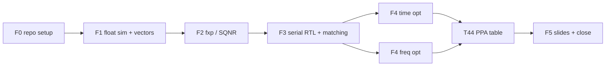
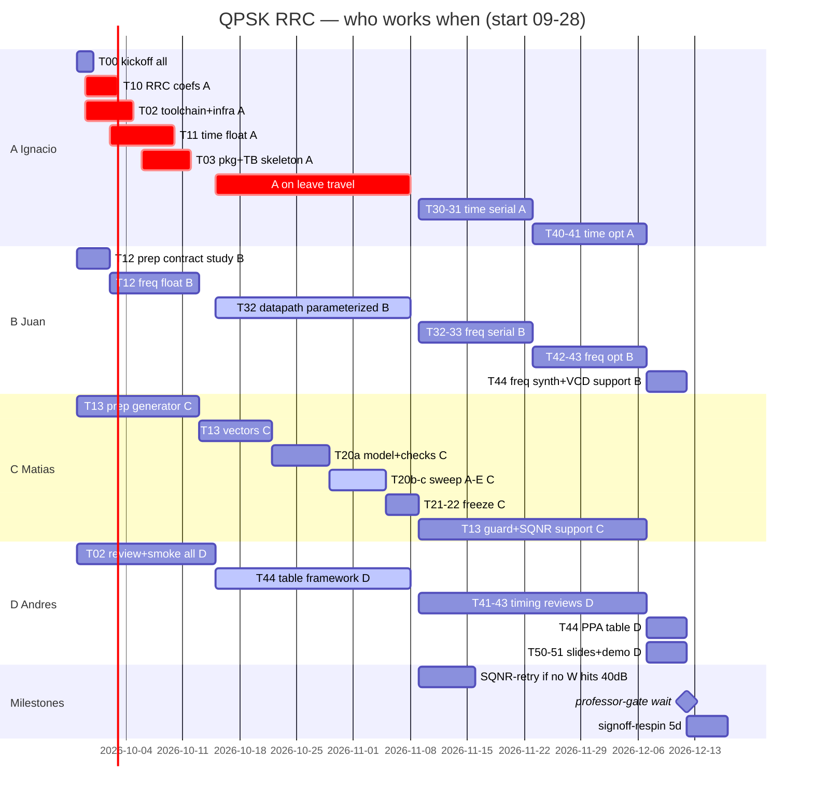

# Plan + Gantt — QPSK RRC time vs frequency (4-person team)

> Planning Project: [QPSK RRC Filter - Plan](https://github.com/users/iledesma08/projects/3). It tracks repository setup and Wayfinder map #1 only.
> The execution Project, created with Wayfinder map #2, will be the live scheduler for technical work, status, assignees, and dates.
> This document is the setup milestone snapshot; the second map owns the detailed execution Gantt and issues.

## Phases and dependencies

> T13 (`sim/vectors/` generator) is the F1 exit criterion and unblocks F2/F3. F4 time and F4 freq run in parallel and rejoin at T44.
> Critical dependency chain: `T13 -> T20 -> T22 -> T30/T32` (vectors → fxp model → frozen coefs → serial RTL).
> `SQNR-retry` (7d, only if no width hits 40 dB) extends F2; `signoff-respin` (5d) follows T44;
> `professor-gate` is a zero-duration wait before F5 sign-off.

- **F1** produces RRC `rrc8-v1` (α=0.5, 8 taps, OS 2x, `D=3.5`) + float golden in time and frequency + `canonical` + 3 `sys_corners` vectors with normative manifest (257 blocks). Contracts: #13, #14, #15, schema.
- **F2** locks `W_common` with SQNR ≥ 40 dB **both** domains (phases A–E, RNE/sat, `2W+3`, FFT A/B, split-half, zero overflow/sat). Contract: #16.
- **F3** requires 100% exact int-code vector matching in both versions (incl. `sys_corners`, latency/`II`, bubble/stall robustness) before optimizing. Contracts: #17, #14.
- **F4** runs the 12-row matrix (time `S×P`, freq `U` + `F-F2`) from one parameterized source, same-SDC/sizing/signoff, VCD/SAIF power, Pareto ranking. Contracts: #18, #19, #2.
- **F5** contrasts PPA + lessons learned + actual vs planned Gantt. AWGN annex #35 stays dormant Python-only, never DoD.

## Milestones (suggested tags)

| Milestone | Criterion | Tag |
| --------- | --------- | --- |
| M1 float golden | green pytest + eye/spectrum plots + documented coefs | `v0.1-float` |
| M2 fixed point | N bits chosen + SQNR ≥ 40 dB recorded | `v0.2-fxp` |
| M3 serial | 100% time and freq vector matching | `v0.3-serial` |
| M4 optimized | fmax target + PPA report + vector matching | `v1.0-opt` |
| M5 close | slides + actual Gantt + demo | `v1.1-close` |

Clocks: 100 MHz is the primary target; 10 MHz is an explicitly labelled fallback when timing does not close. D3 interpretation: 10 MHz is recovery, never ranked with 100 MHz passes. If professor intended slow-power class, add low-power lane.

## Tasks (T) — issue granularity

### F0 — Repo setup + toolchain/infra (pre-absence load for A)

| ID | Task | Comes from | Owner / window |
| -- | ---- | ---------- | -------------- |
| T00 | Organized repo (this pack) + labels + `main` protection | this PR | all |
| T01 | Fill in team table in README + create GitHub Project | T00 | all |
| T02 | Toolchain/infra: `requirements.txt` pins (`toolchain-gap-2.md`), `run.sh` ×4 (time/freq serial/opt, `iverilog -g2012` + `vvp` nonzero-on-mismatch), Verilator lint-only CI (DUT only), SDC template (`PNR/SIGNOFF` identical except period) + OpenLane JSON skeleton per variant (DUT only, syn-commit rule), per-machine smoke re-verify per `openlane-env-19.md` | T00 | **A before 2026-10-05**; D reviews |
| T03 | Streaming skeleton (no frozen coefs): `rtl/common/rrc_pkg.sv` (`FFT_LEN=16,HOP=8,DISCARD_PREFIX=8,EMIT_START=8,EMIT_LEN=8,DATA_WIDTH/SPC` params), handshake/reset shell (`valid/ready`, async-assert/sync-deassert + 2-flop sync), packed `{Q,I}` + signed casts, manifest-driven TB skeleton (`DATA_WIDTH/SPC/valid_start/valid_len/latency_samples` from manifest, exact int-code compare, bubble/stall scoreboard hooks) per `rtl-streaming-17.md` | T02 | **A before 2026-10-13**; B reviews freq params for professor-gate switch |

> T02/T03 are the front-load: they let B/C/D work Oct15–Nov08 without A and make T30/T31 a fill-in after return.

### F1 — Floating-point simulator (golden)

| ID | Task | Depends on | DoD |
| -- | ---- | ---------- | --- |
| T10 | RRC coefficients α=0.5, 8 taps, OS 2x + generator script per `rrc-coefficient-contract-13.md` D1-D7 | T00 | centered grid `t[n]=(n-3.5)/2`, raw + L2-normalized vector (`sum(h²)=1`), `D=3.5` documented, artifact `rrc8-v1` fields, symmetry/energy/singular-branch checks, stem + `freqz`-4096 + eye plots on natural grid |
| T11 | QPSK gen + 2x upsampling + **time** float filter per `qpsk-stimulus-15.md` D1-D8 | T10 | `S=1024, default_rng(2026)`, 5×8 edge patterns, zero-insertion `L=2048`, full causal `2055`, center `2k+3.5`, Gray map, `Es=2`; pytest (regen-identical, even=symbol/odd=zero, `len=2055`, impulse→taps, time/freq `rtol=1e-10,atol=1e-12`) + eye/spectrum on natural grid; **A must finish by 2026-10-10 (buffer before absence)** |
| T12 | **Frequency** float filter (forced-50% OLS `N=16,H=8`, discard `z[0:8]`, emit `z[8:16]`) per `frequency-block-contract-14.md` D1 | T10 | frame `x[8b-8+r]`, 8-zero pre-frame, NumPy `1/N`-once, `I=real,Q=imag`, block cadence 8, 7-check suite (`S=32` OLS/OLA/canonical-H9, impulse, packing round-trip, ~1e-15), no unexplained shift; professor-gate: hop-9 needs approval |
| T13 | `sim/vectors/` generator + checksum (F1 exit, C guards) per `qpsk-stimulus-15.md` + `vector-manifest-schema.md` + ADR-0004 | T11, T12 | `canonical` + 3 full-length `sys_corners` (`corner_repeat,max_alternation,single_symbol_perturbation`), packed `{Q[15:0],I[15:0]}` `.hex` via `$readmemh`, normative §1-§4 manifest, invariants (`2048/2055/0/2055`, `FFT16/H8/D8/E8`, `DATA_WIDTH==W_common`), per-file `.sha256` + CI hash gate, `vector_manifest.svh` metadata-only, 257-block accounting, never by hand |

### F2 — Fixed point + SQNR (C owns, runs through A-absence; A reviews time arm before 2026-10-14)

| ID | Task | Depends on | DoD |
| -- | ---- | ---------- | --- |
| T20 | Fxp model (coefs + data) + SQNR function per `fxp-policy-16.md` + ADR-0005 | T13 | common `Q2.(W-2)`, RNE-at-narrowing + saturate-only-at-boundary + fail-on-internal-overflow, `W_acc=2W+3` baseline, freq A (grow) / B (1b/stage) widths, `divide-by-16-then-cast`, complex SQNR `10log(sum\|y\|²/sum\|y-yfxp\|²)`, directed saturation/extreme/LSB checks + RNE-tie reachability check, signed-SV discipline, sign-extend-to-16 |
| T21 | Bit-width sweep + N choice (SQNR ≥ 40 dB) phases A–E | T20 | `W=8,10,12,14,16,18(+20)`: A common-format × RNE/trunc, B wrap-diagnostic, C `2W+1/2/3`, D A-vs-B at same `W`, E `Q1` sensitivity (never in common claim); split-half stability (>0.5dB → 4096 sym); row fields + overflow/sat counters; lowest `W_common` passing **both** domains, zero overflow/sat; width frozen without PPA-snooping (defer to #18) |
| T22 | Freeze fxp coefs in `rtl/common/` | T21 | common-`Q2` ints (e.g. `[179,-1818,1818,11295,11295,1818,-1818,179]` at 16b), float-golden + derived-ints artifact, range-violation record, hex/bin + doc; unblocks F3 |

### F3 — Serial RTL + vector matching (B runs freq during/after absence; A fills time after return on T03 skeleton)

| ID | Task | Depends on | DoD |
| -- | ---- | ---------- | --- |
| T30 | Serial **time** RTL (1 MAC / sample, `S=1,II=8`) per `rtl-streaming-17.md` | T22, T03 | `valid/ready` + hold, reset-sync, packed `{Q,I}`, `SPC=1`, FIR advances on `valid&&ready` only, `ready_o` deasserts 7/8 cycles, `rrc_pkg.sv`, no TB/vectors in DUT |
| T31 | TB + **time** vector matching | T30, T13 | 100% exact int-code match (canonical + 3 `sys_corners`), `latency_samples/cycles` assert (`ready_i=1` run), `II` measured from handshake, bubble/stall + `ready_o`-loss robustness with scoreboard, no X/Z post-reset, manifest-driven widths, mismatch = index+expected+got + log |
| T32 | Serial **frequency** RTL (`U=1`) per `rtl-streaming-17.md` + `frequency-block-contract-14.md` | T22, T03 | same handshake/reset/packing + parameterized `FFT_LEN/HOP/DISCARD_PREFIX/EMIT_START/EMIT_LEN`, DUT-zero-history, `valid_o` = `EMIT_LEN` contiguous per block, 257-block (256+1 tail-flush) handling, hop-9 switch = counter+selector only |
| T33 | TB + **frequency** vector matching | T32, T13 | same gates as T31 on freq lane (257-block VCD coverage, fill-vs-tail latency split, steady `II` on first 256) + log |

### F4 — Optimized RTL (12-row matrix per `ppa-matrix-18.md`; A=time rows after return, B=freq rows, D=table)

> Time → **pipeline + systolic** (`S,P`), frequency → **unfolded** (`U`) + one **folded** (`F`) contrast, per ADR-0006.
> All variants from one parameterized source, bit-exact (same rounding/sat/widths); `II=8/S` (time), `II` measured from handshake.

| ID | Task | Depends on | DoD |
| -- | ---- | ---------- | --- |
| T40 | Opt **time** RTL: `T-S2P1,S4P1,S8P1,S2P2,S4P2,S8P2` (`S`=tap PEs, `P=1` 1-cut / `P=2` mul-add split) | T31 | vector matching (all rows) + Booth-share + `$readmemh`-vs-`case`-ROM paths tested; `P=1/P=2` realizability confirmed without numeric change |
| T41 | Constraints + timing closure **time** | T40 | same SDC (`PNR/SIGNOFF` identical except period), sizing 55% util floor `200×200` (PDN-0185), die/core/util per row; 100 MHz pass or unchanged-RTL 10 MHz fallback in **separate** table |
| T42 | Opt **frequency** RTL: `F-U2,U4,U8` + `F-F2` (F2 = U8-schedule folded ×2) | T33 | vector matching + same source/bit-exact rule; `U=8` = full radix-2 butterfly parallelism |
| T43 | Constraints + timing closure **frequency** | T42 | same rules as T41; freq VCD covers all 257 blocks |
| T44 | Compared 12-row PPA table time vs freq (D owns; A/B run own synth + VCD/SAIF power) | T41, T43 | Pareto (area vs effective throughput, power/output when annotated) with gates (100% match + DRC/LVS/antenna + timing); fields `lane,arch,S,P,U,F,fft_n,hop,clock,timing,vector,area,die,core,util,ws/tns,hold,fmax,ii,samp_per_cycle,power,power_status,activity,coverage,drc,lvs,antenna,run_tag` + raw `resolved.json/metrics.json/csv/summary.rpt/max/min/checks/power.rpt`; derived `samp/s/um², energy/output, II`; syn-commit rule (inputs committed even if unrun; unrun≠result) |

> D3 interpretation for T41/T43/T44: 10 MHz is recovery, never ranked with 100 MHz passes. T44 compares only rows closed at the same target.

### F5 — Slides + close

| ID | Task | Depends on | DoD |
| -- | ---- | ---------- | --- |
| T50 | Slides: contrast + PPA + lessons learned | T44 | PDF in `docs/slides/`; evidence per `ppa-matrix-18.md` (taps/response, SQNR, EVM vs float golden, constellation, eye/zero-ISI on canonical frame) + dormant `link-awgn-annex-35.md` if built (dual-arm float vs FXP-at-`W_common`, ideal/long TX ±8 sym — never 8-tap, `Es=2`, seed 2035, labelled interp, ideal-sync list, ≥100 errors/point, `Q(sqrt(Es/N0))`, loss at ref BER; no `vectors/rtl/tb` touch, never DoD) |
| T51 | Actual vs planned Gantt + final demo | T50 | this table updated + `v1.1-close` tag |

The T-task taxonomy below is the high-level plan. Detailed execution issues,
technical research, and their native dependencies belong to the second
execution Wayfinder map; do not create all T00-T51 issues from this setup map.

## Initial 4-way split (all start 09-28; only A front-loads for travel)

| Person | Member | Main lane | Responsibility |
| ------ | ------ | --------- | -------------- |
| A | Ignacio (`iledesma08`) | Time + infra (front-loaded pre-travel) | **09-28→10-12:** T10 (09-29→10-02) + T02 (09-29→10-04) + T11 (10-02→10-10) + T03 (10-06→10-12) + T20a time-arm review; **absent 10-15→11-08;** **11-09→:** T30, T31, T40, T41 + time synth/VCD |
| B | Juan (`JRondon23`) | Frequency lane | **09-28→10-02:** T12 prep — study #13/#14/#17 contracts; T12 (10-02→10-13, needs only frozen T10); **10-15→11-08 (no A needed):** T32 datapath (parameterized, frozen T03) + hop-9 professor draft + SDC/JSON verify; **11-09→:** T32, T33, T42, T43 + freq synth/VCD + T44 support |
| C | Matias (`matiascostamagna`) | Sim + FXP | **09-28→10-13:** T13 prep — generator skeleton + review of T10/T11; T13 (10-13→10-22, no A after 10-13); **10-22→11-09:** T20, T21, T22; **11-09→12-07:** vector guard + SQNR debug support for F3/F4 |
| D | Andres (`AndresCesana`) | PPA + close | **09-28→10-15:** T02 review + OpenLane smoke on all machines; **10-15→11-08:** T44 framework + area pre-checks + slides outline; **11-09→12-07:** T41/T43 timing reviews for F3/F4; **12-07→:** T44, T50, T51 |

Rules:

- Nobody merges their own PR (cross-review A↔B, C↔D).
- C guards `sim/vectors/` (only one who regenerates).
- A/B lanes: each lane owner runs their own synthesis + VCD-annotated power runs (A: time lane, B: freq lane); D owns the compared 12-row PPA table (T44) and checks same-target/activity status.
- D keeps this table and the slides up to date.
- If a lane stalls for >2 days, ask for help and move an issue (leave a comment as record).
- A is unavailable 2026-10-15 – 2026-11-08. Handoff rule: A must leave `T10+T11+T02+T03` green on `main` (or PR ready) by 2026-10-13; T13/F2/freq-prep during absence MUST NOT require A. A reviews the T20a time-arm plan before 2026-10-14 async; after 2026-11-09 A resumes time lane only.
- B/C/D use only frozen A outputs (`rrc8-v1` artifact, time golden, `rrc_pkg`/TB skeleton) during absence; any time-lane question waits for 11-09 unless it blocks F2 — then reassign with comment record.

## Estimated Gantt (starts Mon 2026-09-28; by person)

> **How to read:** each `section` is one person. Everyone starts **09-28**. Only A compacts work before travel; B/C/D spread work across the full timeline.
> Mermaid colors (GitHub-limited): `crit` = **red** (A pre-travel load + leave gap, A lane only), `active` = **blue** (full-scope work done while A is away), unmarked = **normal**, `milestone` = diamond.
> Every bar names the T-task it implements; the legend below details input, output, and why absence-period bars need no A.

> Project start Mon 2026-09-28. A-full-load Sep29–Oct12 (`T10+T02+T11+T03` in red) leaves frozen `rrc8-v1`, time golden, and skeletons; B/C/D work Oct15–Nov08 with no A (in blue). `T13` 10-13 (needs `T11` 10-10 + `T12` 10-13); F2 Oct22–Nov09; both serial lanes start 11-09 in parallel after `W_common` freeze.
> Presentation target: 2026-12-11. Internal completion target: 2026-12-04;
> the final week is reserved for PPA synthesis, slides, and rehearsal.
> If the presentation date moves, shift the F4–F5 block while keeping dependency order.

### What each bar means

**A Ignacio** — the only compacted lane (travel 10-15→11-08).
- `T00 kickoff all` (09-28, 2d): repo + project setup with everyone.
- `T10 RRC coefficients` (09-29, 4d): `rrc8-v1` grid, values, unit-energy normalization, artifact, plots. Output unblocks `T11`/`T12`.
- `T02 toolchain+infra` (09-29, 6d): pins, `run.sh` x4, lint CI, SDC template, OpenLane JSON skeletons, per-machine smoke. Output unblocks every lane.
- `T11 time float golden` (10-02, 8d): 1024-symbol frame, edge patterns, zero insertion, full 2055-sample golden + checks. Must finish 10-10 as handoff buffer.
- `T03 pkg+TB skeleton` (10-06, 6d): package with block params, handshake/reset shell, manifest-driven TB skeleton without frozen coefs. Output lets B/C/D work during the absence.
- `A on leave travel` (10-15, 24d): calendar gap in the A lane only — assigns no work and blocks nobody.
- `T30-31 time serial` (11-09, 14d): time serial RTL + full matching on the `T03` skeleton after the `W` freeze.
- `T40-41 time opt` (11-23, 14d): 6 time rows (`S×P`) + timing closure.

**B Juan** — full workload, no gap.
- `T12 prep contract study` (09-28, 4d): study #13/#14/#17, set up the freq sim harness. Input: draft `T10`. Output: ready harness.
- `T12 freq float golden` (10-02, 11d): forced-50% OLS float model + 7-check suite. Input: frozen `T10` only.
- `T32 datapath parameterized` (10-15, 24d, blue): full serial freq datapath with parameterized `W` and block params, verified against the float golden with placeholder coefs; the frozen coef table is plugged in after the `W` freeze. Includes the hop-9 professor draft + SDC/JSON verify. Input: frozen `T03+T12` only — no A needed. This is full design scope, not filler.
- `T32-33 freq serial` (11-09, 14d): coef integration + 257-block matching.
- `T42-43 freq opt` (11-23, 14d): `U`/`F` rows + closure.
- `T44 freq synth support` (12-07, 5d): freq synth runs + VCD activity for D's table.

**C Matias** — full workload, no gap.
- `T13 prep generator` (09-28, 15d): generator skeleton + review of `T10`/`T11` drafts.
- `T13 golden vectors` (10-13, 9d): canonical + 3 full-length corner sets, normative manifest, per-file hashes, 257-block accounting. Input: frozen `T11+T12` only — no A after 10-13.
- `T20a model+checks` (10-22, 7d): FXP model + SQNR + directed/tie checks.
- `T20b-c sweep phases A-E` (10-29, 7d, blue): width/rounding/accumulator/FFT-schedule sweep + split-half check.
- `T21-22 width freeze` (11-05, 4d): common-`Q2` ints + artifact; unblocks F3.
- `T13+F2 support for F3-F4` (11-09, 28d): vector guard + SQNR debug for serial/opt mismatches.

**D Andres** — full workload, no gap.
- `T02 review+smoke all` (09-28, 17d): review A's infra, run smoke on every machine.
- `T44 framework` (10-15, 24d, blue): table template, constraint/config checks, area pre-checks, slides outline. Input: `T02` only — no A needed. This is full PPA-groundwork scope, not filler.
- `T41-43 timing reviews` (11-09, 28d): timing review of every F3/F4 row.
- `T44 PPA table` (12-07, 5d): 12-row Pareto with gates + evidence.
- `T50-51 slides+demo` (12-07, 5d): slides + actual-vs-planned Gantt + demo.

**Milestones** — `SQNR-retry` runs only if no width hits 40 dB; `professor-gate` is a zero-duration wait; `signoff-respin` follows `T44`.

**Absence audit:** every bar overlapping 10-15→11-08 consumes only outputs frozen by 10-13 (`rrc8-v1`, time/freq goldens, package/TB skeleton). None requires A. Had any bar required A, its scope would have moved before 10-13; the audit found none, so no extra pre-leave load was added.

## Risks

| Risk | Mitigation |
| ---- | ---------- |
| FFT/IFFT does not match time | T12 forced-50% schedule + 7-check suite (`rtol=1e-10,atol=1e-12`) from day 1; no unexplained shift |
| SQNR never reaches 40 dB | Phased sweep A–E (width + rounding + accumulator + FFT A/B) + split-half check before RTL; extend to 20, never lower threshold |
| 100 MHz timing does not close | Same-SDC + sizing rule; unchanged-RTL 10 MHz fallback in separate table; request early review |
| Vectors edited by hand / manifest drift | `sim/vectors/README` + CONTRIBUTING + per-file `.sha256` CI gate; TB reads manifest, never hardcodes; C is sole regenerator |
| Professor gate (hop-9) | Keep hop-8 baseline; B drafts proposal (option c) during absence; hop params, no RTL fork until approval |
| 12-row PPA overload | One parameterized source + finalist-only reruns; A/B run own synth/VCD, D owns table; syn-commit rule |
| Power ranked without activity | VCD/SAIF full-257 per candidate; unannotated = estimate, excluded from dynamic ranking |
| A unavailable 10-15–11-08 | A-full-load Sep29–Oct12 (T10+T02+T11+T03 green); absence work (T13/F2/freq-datapath/T44-framework) needs no A; time lane resumes 11-09 |
| One lane races ahead | Weekly cross-reviews + actual Gantt in T51 |
