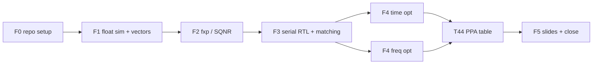
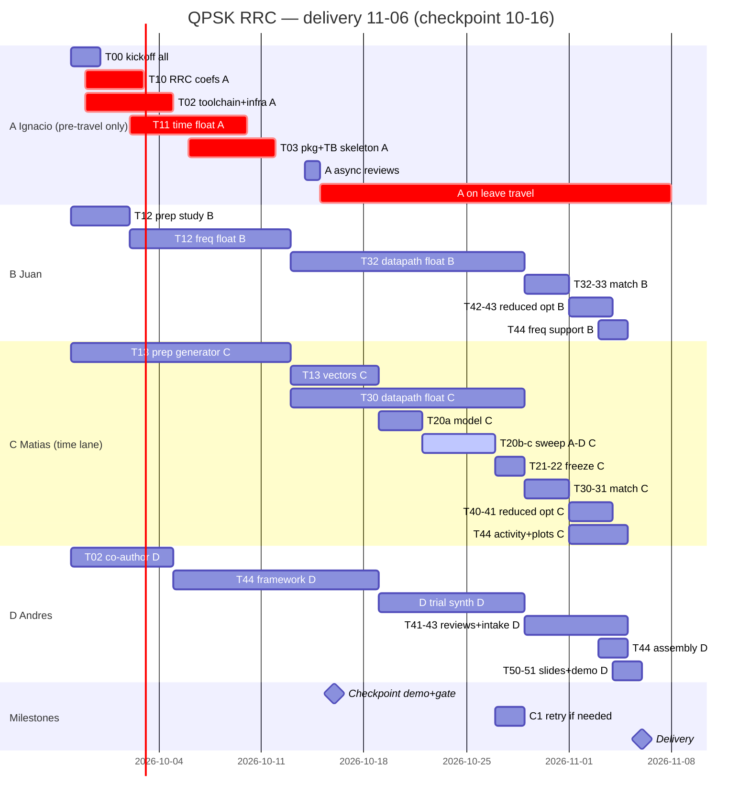

# Plan + Gantt — QPSK RRC time vs frequency (4-person team)

> Planning Project: [QPSK RRC Filter - Plan](https://github.com/users/iledesma08/projects/3). It tracks repository setup and Wayfinder map #1 only.
> Execution Project: [QPSK RRC Filter - Execution](https://github.com/users/iledesma08/projects/4). This document is the live execution plan: milestones, T-tasks with owners and dates, and the by-person Gantt.

## Phases and dependencies

> T13 (`sim/vectors/` generator) is the F1 exit criterion and unblocks F2/F3. F4 time and F4 freq run in parallel and rejoin at T44.
> Critical dependency chain: `T13 -> T20 -> T22 -> T30/T32` (vectors → fxp model → frozen coefs → serial RTL).
> `SQNR-retry` (7d, only if no width hits 40 dB) extends F2; `signoff-respin` (5d) follows T44;
> `professor-gate` is a zero-duration wait before F5 sign-off.

- **F1** produces RRC `rrc8-v1` (α=0.5, 8 taps, OS 2x, `D=3.5`) + float golden in time and frequency + `canonical` + 3 `sys_corners` vectors with normative manifest (257 blocks). Contracts: #13, #14, #15, schema.
- **F2** locks `W_common` with SQNR ≥ 40 dB **both** domains (phases A–D, RNE/sat, `2W+3`, FFT A/B, split-half, zero overflow/sat). Contract: #16.
- **F3** requires 100% exact int-code vector matching in both versions (incl. `sys_corners`, latency/`II`, bubble/stall robustness) before optimizing. Contracts: #17, #14.
- **F4** runs the reduced 6-row matrix (serials + S4/S8 + U4/U8) from one parameterized source, same-SDC/sizing/signoff, VCD/SAIF power, Pareto ranking. Contracts: #18, #19, #2.
- **F5** contrasts PPA + lessons learned + actual vs planned Gantt. AWGN annex #35 stays dormant Python-only, never DoD.

## Milestones (suggested tags)

| Milestone | Criterion | Due | Tag |
| --------- | --------- | --- | --- |
| M1 float golden | green pytest + eye/spectrum plots + documented coefs + vectors | 10-19 | `v0.1-float` |
| M2 fixed point | `W_common` chosen + SQNR ≥ 40 dB both domains recorded | 10-29 | `v0.2-fxp` |
| M3 serial | 100% time and freq vector matching | 11-01 | `v0.3-serial` |
| M4 optimized | reduced 6-row PPA (serials + S4/S8 + U4/U8) + report + matching; full 12 rows only on extension | 11-05 | `v1.0-opt` |
| M5 close | slides + actual Gantt + demo | 11-06 | `v1.1-close` |

Clocks: 100 MHz is the primary target; 10 MHz is an explicitly labelled fallback when timing does not close. D3 interpretation: 10 MHz is recovery, never ranked with 100 MHz passes. If professor intended slow-power class, add low-power lane.

## Tasks (T) — issue granularity

### F0 — Repo setup + toolchain/infra (pre-absence load for A)

| ID | Task | Comes from | Owner / window |
| -- | ---- | ---------- | -------------- |
| T00 | Organized repo (this pack) + labels + `main` protection | this PR | all |
| T01 | Fill in team table in README + create GitHub Project | T00 | all |
| T02 | Toolchain/infra: `requirements.txt` pins (`toolchain-gap-2.md`), `run.sh` per variant (time/freq serial/opt) plus the top-level `rtl/run.sh`, `iverilog -g2012` + `vvp` nonzero-on-mismatch, Verilator lint-only CI (DUT only), SDC template (`PNR/SIGNOFF` identical except period) + OpenLane JSON skeleton per variant (DUT only, syn-commit rule), per-machine smoke re-verify per `openlane-env-19.md` | T00 | **A+D co-author before 2026-10-05** |
| T03 | Streaming skeleton (no frozen coefs): `rtl/common/rrc_pkg.sv` (`FFT_LEN=16,HOP=8,DISCARD_PREFIX=8,EMIT_START=8,EMIT_LEN=8,DATA_WIDTH/SPC` params), handshake/reset shell (`valid/ready`, async-assert/sync-deassert + 2-flop sync), packed `{Q,I}` + signed casts, manifest-driven TB skeleton (`DATA_WIDTH/SPC/valid_start/valid_len/latency_samples` from manifest, exact int-code compare, bubble/stall scoreboard hooks) per `rtl-streaming-17.md` | T02 | **A before 2026-10-13**; B reviews freq params for professor-gate switch |

> T02/T03 are the front-load: frozen base (infra + package + TB skeleton) that lets B/C/D build datapaths from 10-13 with no A needed.

### F1 — Floating-point simulator (golden)

| ID | Task | Depends on | DoD |
| -- | ---- | ---------- | --- |
| T10 | RRC coefficients α=0.5, 8 taps, OS 2x + generator script per `rrc-coefficient-contract-13.md` D1-D7 | T00 | centered grid `t[n]=(n-3.5)/2`, raw + L2-normalized vector (`sum(h²)=1`), `D=3.5` documented, artifact `rrc8-v1` fields, symmetry/energy/singular-branch checks, stem + `freqz`-4096 + eye plots on natural grid |
| T11 | QPSK gen + 2x upsampling + **time** float filter per `qpsk-stimulus-15.md` D1-D8 | T10 | `S=1024, default_rng(2026)`, 5×8 edge patterns, zero-insertion `L=2048`, full causal `2055`, center `2k+3.5`, Gray map, `Es=2`; pytest (regen-identical, even=symbol/odd=zero, `len=2055`, impulse→taps, time/freq `rtol=1e-10,atol=1e-12`) + eye/spectrum on natural grid; **A must finish by 2026-10-10 (buffer before absence)** |
| T12 | **Frequency** float filter (forced-50% OLS `N=16,H=8`, discard `z[0:8]`, emit `z[8:16]`) per `frequency-block-contract-14.md` D1 | T10 | frame `x[8b-8+r]`, 8-zero pre-frame, NumPy `1/N`-once, `I=real,Q=imag`, block cadence 8, 7-check suite (`S=32` OLS/OLA/canonical-H9, impulse, packing round-trip, ~1e-15), no unexplained shift; professor-gate: hop-9 needs approval |
| T13 | `sim/vectors/` generator + checksum (F1 exit, C guards) per `qpsk-stimulus-15.md` + `vector-manifest-schema.md` + ADR-0004 | T11, T12 | `canonical` + 3 full-length `sys_corners` (`corner_repeat,max_alternation,single_symbol_perturbation`), packed `{Q[15:0],I[15:0]}` `.hex` via `$readmemh`, normative §1-§4 manifest, invariants (`2048/2055/0/2055`, `FFT16/H8/D8/E8`, `DATA_WIDTH==W_common`), per-file `.sha256` + CI hash gate, `vector_manifest.svh` metadata-only, 257-block accounting, never by hand |

### F2 — Fixed point + SQNR (C owns; phases A–D only for 11-06; A reviews plan before 2026-10-14)

| ID | Task | Depends on | DoD |
| -- | ---- | ---------- | --- |
| T20 | Fxp model (coefs + data) + SQNR function per `fxp-policy-16.md` + ADR-0005 | T13 | common `Q2.(W-2)`, RNE-at-narrowing + saturate-only-at-boundary + fail-on-internal-overflow, `W_acc=2W+3` baseline, freq A (grow) / B (1b/stage) widths, `divide-by-16-then-cast`, complex SQNR `10log(sum\|y\|²/sum\|y-yfxp\|²)`, directed saturation/extreme/LSB checks + RNE-tie reachability check, signed-SV discipline, sign-extend-to-16 |
| T21 | Bit-width sweep + N choice (SQNR ≥ 40 dB) phases A–D | T20 | `W=8,10,12,14,16,18(+20)`: A common-format × RNE/trunc, B wrap-diagnostic, C `2W+1/2/3`, D A-vs-B at same `W`, E `Q1` sensitivity out of scope for 11-06; split-half stability (>0.5dB → 4096 sym); row fields + overflow/sat counters; lowest `W_common` passing **both** domains, zero overflow/sat; width frozen without PPA-snooping (defer to #18) |
| T22 | Freeze fxp coefs in `rtl/common/` | T21 | common-`Q2` ints (e.g. `[179,-1818,1818,11295,11295,1818,-1818,179]` at 16b), float-golden + derived-ints artifact, range-violation record, hex/bin + doc; unblocks F3 |

### F3 — Serial RTL + vector matching (datapath vs float from 10-13, frozen-coef integration after T22)

| ID | Task | Depends on | DoD |
| -- | ---- | ---------- | --- |
| T30 | Serial **time** RTL (1 MAC / sample, `S=1,II=8`) per `rtl-streaming-17.md` | T22, T03 | `valid/ready` + hold, reset-sync, packed `{Q,I}`, `SPC=1`, FIR advances on `valid&&ready` only, `ready_o` deasserts 7/8 cycles, `rrc_pkg.sv`, no TB/vectors in DUT |
| T31 | TB + **time** vector matching | T30, T13 | 100% exact int-code match (canonical + 3 `sys_corners`), `latency_samples/cycles` assert (`ready_i=1` run), `II` measured from handshake, bubble/stall + `ready_o`-loss robustness with scoreboard, no X/Z post-reset, manifest-driven widths, mismatch = index+expected+got + log |
| T32 | Serial **frequency** RTL (`U=1`) per `rtl-streaming-17.md` + `frequency-block-contract-14.md` | T22, T03 | same handshake/reset/packing + parameterized `FFT_LEN/HOP/DISCARD_PREFIX/EMIT_START/EMIT_LEN`, DUT-zero-history, `valid_o` = `EMIT_LEN` contiguous per block, 257-block (256+1 tail-flush) handling, hop-9 switch = counter+selector only |
| T33 | TB + **frequency** vector matching | T32, T13 | same gates as T31 on freq lane (257-block VCD coverage, fill-vs-tail latency split, steady `II` on first 256) + log |

### F4 — Optimized RTL (reduced 6-row matrix for 11-06; full 12-row on extension — C=time rows, B=freq rows, D=table)

> Reduced matrix for 11-06: serials + `T-S4P1`/`T-S8P1` + `F-U4`/`F-U8`. Full 12-row matrix (with `P=2`, `U2`, folded) only on extension — per the contract #18 amendment (6-row baseline decided 2026-09-25).
> All variants from one parameterized source, bit-exact (same rounding/sat/widths); `II=8/S` (time), `II` measured from handshake.

| ID | Task | Depends on | DoD |
| -- | ---- | ---------- | --- |
| T40 | Opt **time** RTL: `T-S4P1,S8P1` (reduced for 11-06; full factorial on extension) | T31 | vector matching (both rows) + Booth-share + `$readmemh`-vs-`case`-ROM paths tested; `P=1/P=2` realizability confirmed without numeric change |
| T41 | Constraints + timing closure **time** | T40 | same SDC (`PNR/SIGNOFF` identical except period), sizing 55% util floor `200×200` (PDN-0185), die/core/util per row; 100 MHz pass or unchanged-RTL 10 MHz fallback in **separate** table |
| T42 | Opt **frequency** RTL: `F-U4,U8` (reduced for 11-06; U2/folded on extension) | T33 | vector matching + same source/bit-exact rule; `U=8` = full radix-2 butterfly parallelism |
| T43 | Constraints + timing closure **frequency** | T42 | same rules as T41; freq VCD (C-operated pipeline) covers all 257 blocks |
| T44 | Compared 6-row PPA table time vs freq (reduced; 12 on extension) (D owns; B/C run own-lane synth, C runs shared activity pipeline, D assembles) | T41, T43 | Pareto (area vs effective throughput, power/output when annotated) with gates (100% match + DRC/LVS/antenna + timing); fields `lane,arch,S,P,U,F,fft_n,hop,clock,timing,vector,area,die,core,util,ws/tns,hold,fmax,ii,samp_per_cycle,power,power_status,activity,coverage,drc,lvs,antenna,run_tag` + raw `resolved.json/metrics.json/csv/summary.rpt/max/min/checks/power.rpt`; derived `samp/s/um², energy/output, II`; syn-commit rule (inputs committed even if unrun; unrun≠result) |

> D3 interpretation for T41/T43/T44: 10 MHz is recovery, never ranked with 100 MHz passes. T44 compares only rows closed at the same target.

### Delivered scope for 11-06 (decided 2026-09-25; checkpoint confirms progress)

Delivery 11-06 covers exactly these 6 rows — no more, no less:

| Keep | Why it stays |
| ---- | ------------ |
| T-serial (`S=1,P=1`) | Area/timing/throughput reference; every comparison needs it |
| T-S4P1 | Mid systolic scaling point |
| T-S8P1 | Full tap array; S4→S8 reads systolic scaling at fixed `P` |
| F-serial (`U=1`) | Frequency reference; same role as T-serial |
| F-U4 | Mid replication point |
| F-U8 | Full radix-2 butterfly parallelism; U4→U8 reads replication scaling |

| Cut for 11-06 | Why it is the cheapest loss | Returns on extension |
| ------------- | --------------------------- | -------------------- |
| T-S2P1 | Low-parallelism trend readable from S4/S8 without it | yes |
| T-S2P2, T-S4P2 | Pipeline (`P=2`) effect — the only sacrificed axis; the time lane still shows systolic scaling | yes |
| F-U2 | Low replication trend readable from U4/U8 without it | yes |
| F-F2 (folded) | Area/throughput contrast; the reuse argument is shown qualitatively in slides | yes |

Rules: this 6-row scope is decided (contract #18 amendment, 6-row baseline), not pending. The 10-16 checkpoint confirms progress and is the venue to request the extension (then: the full 12-row matrix resumes); otherwise the 6-row delivery stands. No matrix/RTL fork for cut rows without the extension; every datapath stays parameterized so cut rows come back by configuration, not redesign.

### F5 — Slides + close

| ID | Task | Depends on | DoD |
| -- | ---- | ---------- | --- |
| T50 | Slides: contrast + PPA + lessons learned | T44 | PDF in `docs/slides/` (D assembles; technical plots delivered by C by 11-04); evidence per `ppa-matrix-18.md` (taps/response, SQNR, EVM vs float golden, constellation, eye/zero-ISI on canonical frame) + dormant `link-awgn-annex-35.md` if built (dual-arm float vs FXP-at-`W_common`, ideal/long TX ±8 sym — never 8-tap, `Es=2`, seed 2035, labelled interp, ideal-sync list, ≥100 errors/point, `Q(sqrt(Es/N0))`, loss at ref BER; no `vectors/rtl/tb` touch, never DoD) |
| T51 | Actual vs planned Gantt + final demo | T50 | this table updated + `v1.1-close` tag |

The T-task taxonomy above is the live execution plan. It is already instantiated as issues #38–#60 (sub-issues of map #12, owners, milestones M1–M5, native blocking); lazy sub-issues (per-row F4 splits, per-width sweep splits) are added only when their fog graduates.

## Initial 4-way split (delivery 11-06; travel 10-15→11-08; C takes the time lane)

| Person | Member | Main lane | Responsibility |
| ------ | ------ | --------- | -------------- |
| A | Ignacio (`iledesma08`) | Pre-travel only (no delivery tasks) | **09-28→10-14:** T10 (09-29→10-02) + T02 (09-29→10-04) + T11 (10-02→10-10) + T03 (10-06→10-12) + async reviews (T20a plan + C time-datapath plan, 10-14); **travel 10-15→11-08** — delivery happens without A; back only if extension is granted |
| B | Juan (`JRondon23`) | Frequency lane + checkpoint co-presenter | **09-28→10-13:** T12 prep + T12 golden (needs only frozen T10); **10-13→10-29:** freq datapath + TB vs float (parameterized W) + hop-9 draft; **10-29→11-01:** coef integration + 100% match; **11-01→11-04:** reduced opt (U4/U8) + closure; **11-03→11-05:** freq synth support for T44 |
| C | Matias (`matiascostamagna`) | Transversal + TIME lane (hottest lane — 1d stall rule) | **09-28→10-13:** T13 prep + review of T10/T11; **10-13→10-19:** T13 vectors; **10-13→10-29:** time datapath + TB vs float (parallel with vectors/F2); **10-19→10-29:** T20→T21→T22 (phases A–D only); **10-29→11-01:** coef integration + 100% match; **11-01→11-04:** reduced opt (S4P1/S8P1) + closure; **11-01→11-05:** activity runs + evidence plots (by 11-04) + vector guard |
| D | Andres (`AndresCesana`) | PPA + close + checkpoint organizer | **09-28→10-05:** T02 co-author (JSON/SDC skeletons, A reviews) + smoke all machines; **10-05→10-19:** T44 framework + intake pipeline + slides outline; **10-19→10-29:** trial synth of both datapaths (de-risks closure); **10-29→11-05:** per-row reviews + incremental intake; **11-03→11-06:** T44 assembly + T50/T51 slides + demo + rehearsal |

Rules:

- Nobody merges their own PR (cross-review A↔B, C↔D).
- C guards `sim/vectors/` (only one who regenerates).
- A/B lanes: each lane owner runs their own synthesis (C: time lane, B: freq lane); C operates the shared activity-run pipeline producing one VCD/SAIF per row for every candidate; D owns the compared 6-row PPA table (T44) and checks same-target/activity status.
- D keeps this table and the slides up to date.
- If a lane stalls for >2 days, ask for help and move an issue (leave a comment as record).
- Crunch cadence 10-27→11-06: daily 15-min standup (A on Zoom until 10-15, then B/C/D); 1d stall rule for everyone in that window, replacing the 2d rule above (C keeps 1d throughout its triple stream).
- A is unavailable 2026-10-15 – 2026-11-08 and misses both the 10-16 checkpoint and the 11-06 delivery. Handoff rule: A must leave `T10+T11+T02+T03` green on `main` (or PR ready) by 2026-10-13; A reviews the T20a plan and C's time-datapath plan async on 2026-10-14. No work may require A after 10-14.
- B/C/D work only from frozen A outputs (`rrc8-v1` artifact, time golden, `rrc_pkg`/TB skeleton); C owns the time lane from 10-13 and B/C/D present the checkpoint. Any A question waits for a possible extension — otherwise it is decided without A and recorded.

## Estimated Gantt (delivery Fri 2026-11-06; checkpoint Fri 2026-10-16)

> **How to read:** each `section` is one person. Delivery 11-06, checkpoint 10-16. A works only pre-travel; C carries transversal + time lane; zero slack — the checkpoint locks scope.
> Mermaid colors (GitHub-limited): `crit` = **red** (pre-travel/pre-checkpoint critical + leave gap), `active` = **blue** (sweep crunch), unmarked = **normal**, `milestone` = diamond.
> Every bar names the T-task it implements; the legend below details input, output, and owner.

> Project start Mon 2026-09-28. A leaves frozen `rrc8-v1`, time golden, and skeletons by 10-13 (red) + async reviews 10-14. Checkpoint 10-16 demos goldens + T13 progress + revised plan. Datapaths verify vs float from 10-13; `W_common` freezes 10-29; serials match by 11-01; reduced 6-row PPA + slides close 11-06.
> Delivery Fri 2026-11-06; checkpoint Fri 2026-10-16 (professor gate: ratify the reduced matrix or grant extension).
> If the extension is granted, the F4–F5 block stretches while keeping dependency order.

### What each bar means

**A Ignacio** — pre-travel only; misses checkpoint and delivery by design.
- `T00 kickoff all` (09-28, 2d): repo + project setup with everyone.
- `T10 RRC coefficients` (09-29, 4d): `rrc8-v1` grid, values, unit-energy normalization, artifact, plots. Output unblocks `T11`/`T12`.
- `T02 toolchain+infra` (09-29, 6d): pins, per-variant `run.sh` + top-level, lint CI, SDC template, OpenLane JSON skeletons, per-machine smoke. Output unblocks every lane.
- `T11 time float golden` (10-02, 8d): 1024-symbol frame, edge patterns, zero insertion, full 2055-sample golden + checks. Must finish 10-10 as handoff buffer.
- `T03 pkg+TB skeleton` (10-06, 6d): package with block params, handshake/reset shell, manifest-driven TB skeleton without frozen coefs. Output lets B/C/D work during the absence.
- `A async reviews` (10-14, 1d): review the T20a plan and C's time-datapath plan the day before travel.
- `A on leave travel` (10-15, 24d): travel unchanged; delivery happens without A — nothing resumes after, by design.

**B Juan** — steady frequency lane; checkpoint co-presenter.
- `T12 prep contract study` (09-28, 4d): study #13/#14/#17, set up the freq sim harness. Input: draft `T10`. Output: ready harness.
- `T12 freq float golden` (10-02, 11d): forced-50% OLS float model + 7-check suite. Input: frozen `T10` only.
- `T32 datapath float` (10-13, 16d): full serial freq datapath + TB vs float golden with placeholder coefs, parameterized `W`; hop-9 draft included. Input: frozen `T03+T12` only.
- `T32-33 match` (10-29, 3d): coef-table integration + 100% match + robustness — pre-verified vs float, hence 3d.
- `T42-43 reduced opt` (11-01, 3d): `F-U4`/`F-U8` + closure (U2/folded on extension).
- `T44 freq support` (11-03, 2d): synth runs feeding D's incremental assembly.

**C Matias** — transversal + time lane (hottest lane, 1d stall rule).
- `T13 prep generator` (09-28, 15d): generator skeleton + review of `T10`/`T11` drafts.
- `T13 golden vectors` (10-13, 6d): canonical + 3 full-length corner sets, normative manifest, per-file hashes. Compressed from 9d: skeleton pre-built, goldens frozen day one.
- `T30 datapath float` (10-13, 16d): full serial time datapath + TB vs float golden with placeholder coefs; runs parallel with vectors/F2. A reviewed the plan 10-14.
- `T20a model` (10-19, 3d): FXP model + SQNR + directed/tie checks (skeletons already in-tree).
- `T20b-c sweep A-D` (10-22, 5d, blue): width/rounding/accumulator/FFT-schedule sweep + split-half check (phase E already out of scope) — the crunch both F3 lanes wait on.
- `T21-22 freeze` (10-27, 2d): common-`Q2` ints + artifact; unblocks both serials.
- `T30-31 match` (10-29, 3d): coef integration + 100% match (pre-verified vs float).
- `T40-41 reduced opt` (11-01, 3d): `T-S4P1`/`T-S8P1` + closure.
- `T44 activity+plots` (11-01, 4d): one VCD/SAIF per row as rows close + evidence plots by 11-04 + vector guard.

**D Andres** — PPA + close; checkpoint organizer.
- `T02 co-author` (09-28, 7d): OpenLane JSON/SDC skeletons (A reviews) + smoke all machines.
- `T44 framework` (10-05, 14d): table template with auto-fill intake, slides outline from day one.
- `D trial synth` (10-19, 10d): synthesis smoke of both datapaths — de-risks the 11-01 closure with zero RTL risk.
- `T41-43 reviews+intake` (10-29, 7d): per-row timing review + incremental intake as rows close.
- `T44 assembly` (11-03, 2d): assembly-from-filled-template + Pareto defense.
- `T50-51 slides+demo` (11-04, 2d): assembly on plots arriving from C by 11-04 + demo + rehearsal from the draft table.

**Milestones + gate** — `Checkpoint demo+gate` (10-16, B/C/D): frozen set T10+T11+T12+T02/T03 + T13 progress + revised plan; ratifies the reduced matrix or triggers extension/scope-cut. `C1 retry` (10-27, 2d, conditional): consumes the freeze buffer; if triggered, emergency scope call with the professor. `Delivery` (11-06): slides + demo + tag.

**Travel + zero-slack audit:** A misses checkpoint and delivery by design — everything after 10-14 runs without A. The plan has zero slack: any >1d slip before 10-29 consumes the freeze buffer; any slip after 10-29 goes straight to the checkpoint-agreed fallback (reduced scope or extension). C's 10-13→10-29 triple stream is the hottest spot (1d stall rule, D absorbs plots/activity as backup).

### Couplings: where the Gantt is truly parallel vs gated

Truly parallel (no shared gate): B vs C lanes from 10-13 (same T03 skeleton, separate lanes); D vs everyone (framework, trial synth, outline consume only frozen outputs); all three prep streams from day one.

| # | Coupling | Window | Slack / shock absorber |
|---|----------|--------|------------------------|
| 1 | A→all: T03 + T11 frozen | until 10-13 | Handoff 10-13 + async reviews 10-14; single supplier, thin but sufficient buffer |
| 2 | T22 (C) gates both match windows | 10-29→11-01 | Float-first RTL: datapaths + TBs verify vs float for 16d, so a T22 slip delays but invalidates nothing |
| 3 | Opt rows → D assembly + C plots | 11-03→11-05 | Incremental intake from 10-29; serial/FXP plots advanceable, only opt-row EVM arrives last; zero slack regardless |
| 4 | Checkpoint set frozen 10-15 | 10-15→10-16 | Set completes 10-12/10-13 by plan: 2–3d of air |

Non-issues: machine contention (all four run Nix/OpenLane locally per #19 — no shared runner); C's triple stream is load, not a dependency, with priority T13 > freeze > datapath-finish and D absorbing plots/activity as backup.

## Risks

| Risk | Mitigation |
| ---- | ---------- |
| FFT/IFFT does not match time | T12 forced-50% schedule + 7-check suite (`rtol=1e-10,atol=1e-12`) from day 1; no unexplained shift |
| SQNR never reaches 40 dB | Phased sweep A–D (width + rounding + accumulator + FFT A/B) + split-half check before RTL; extend to 20, never lower threshold |
| 100 MHz timing does not close | Same-SDC + sizing rule; unchanged-RTL 10 MHz fallback in separate table; request early review |
| Vectors edited by hand / manifest drift | `sim/vectors/README` + CONTRIBUTING + per-file `.sha256` CI gate; TB reads manifest, never hardcodes; C is sole regenerator |
| Professor gate (hop-9) | Keep hop-8 baseline; B drafts proposal (option c) with the datapath; checkpoint presents it; hop params, no RTL fork until approval |
| PPA matrix overload (reduced scope) | One parameterized source, 6 rows for 11-06; B/C run own-lane synth, C runs activity pipeline, D owns table; syn-commit rule |
| D end-funnel (table+slides pile up Nov04) | Incremental intake from 10-29, C plots by 11-04, assembly-from-template 11-03; rehearsal starts on a draft table, never on empty docs |
| Power ranked without activity | VCD/SAIF full-257 per candidate; unannotated = estimate, excluded from dynamic ranking |
| A misses checkpoint + delivery (travel 10-15–11-08) | Handoff green by 10-13 + async reviews 10-14; checkpoint demo frozen 10-15 by B/C/D; delivery scope needs no A by construction |
| Zero slack to 11-06 | Any >1d slip before 10-29 eats the freeze buffer; after 10-29 it hits the checkpoint-agreed fallback (scope cut or extension) |
| Reduced matrix scope | Decided 6-row base (contract #18 amendment); checkpoint is a progress gate + extension venue, not a scope decision |
| C triple-stream 10-13→10-29 | 1d stall rule on the C lane; D absorbs plots/activity early as backup; datapath pre-verified vs float de-risks matching |
| 3d serial match | Credible only because datapaths + TBs verify vs float for 16d first; the int coef swap is the only delta |
| One lane races ahead | Weekly cross-reviews + actual Gantt in T51 |
