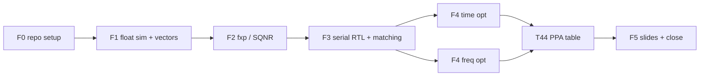
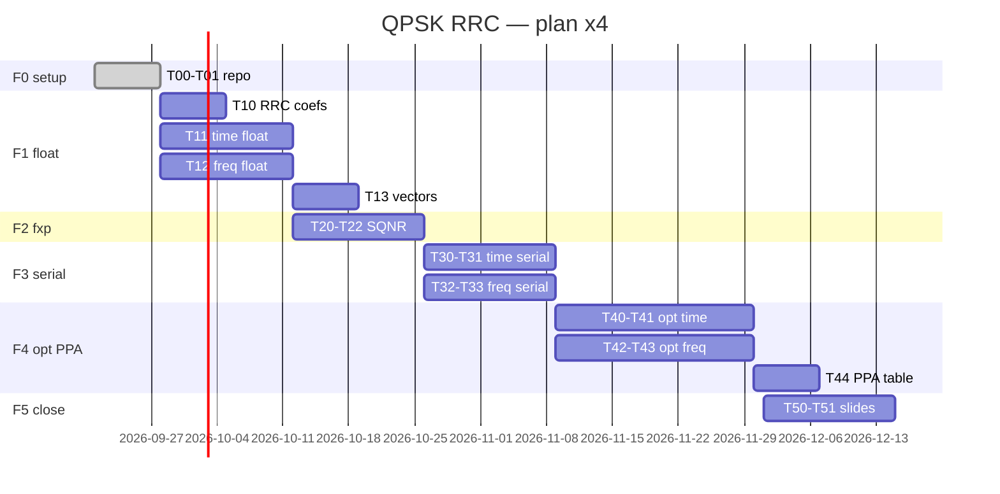

# Plan + Gantt — QPSK RRC time vs frequency (4-person team)

> GitHub Project: [QPSK RRC Filter - Plan](https://github.com/users/iledesma08/projects/3). The Project is the live scheduler for status, assignees, and dates.
> This document is the milestone snapshot: update it at M1-M5 and when the planned-vs-actual Gantt is recorded.
> GitHub issues mirror these tasks (one issue per T task).

## Phases and dependencies

> T13 (`sim/vectors/` generator) is the F1 exit criterion and unblocks F2/F3. F4 time and F4 freq run in parallel and rejoin at T44.

- **F1** produces RRC coefficients (α=0.5, 8 taps, OS 2x) + float golden in time and frequency.
- **F2** locks N bits with SQNR ≥ 40 dB (sweep, one shared decision).
- **F3** requires 100% vector matching in both versions before optimizing.
- **F4** runs in two parallel lanes (time / frequency) with different techniques so results can be contrasted.
- **F5** contrasts PPA + lessons learned + actual vs planned Gantt.

## Milestones (suggested tags)

| Milestone | Criterion | Tag |
| --------- | --------- | --- |
| M1 float golden | green pytest + eye/spectrum plots + documented coefs | `v0.1-float` |
| M2 fixed point | N bits chosen + SQNR ≥ 40 dB recorded | `v0.2-fxp` |
| M3 serial | 100% time and freq vector matching | `v0.3-serial` |
| M4 optimized | fmax target + PPA report + vector matching | `v1.0-opt` |
| M5 close | slides + actual Gantt + demo | `v1.1-close` |

Clocks: 100 MHz is the primary target; 10 MHz is an explicitly labelled fallback when timing does not close.

## Tasks (T) — issue granularity

### F0 — Repo setup (this week, everyone)

| ID | Task | Comes from |
| -- | ---- | ---------- |
| T00 | Organized repo (this pack) + labels + `main` protection | this PR |
| T01 | Fill in team table in README + create GitHub Project | T00 |

### F1 — Floating-point simulator (golden)

| ID | Task | Depends on | DoD |
| -- | ---- | ---------- | --- |
| T10 | RRC coefficients α=0.5, 8 taps, OS 2x + generator script | T00 | coefs + documented impulse/freq plot |
| T11 | QPSK gen + 2x upsampling + **time** float filter | T10 | pytest + eye/spectrum |
| T12 | **Frequency** float filter (FFT→×→IFFT, overlap-add/save) | T10 | pytest + equality vs time (tolerance) |
| T13 | `sim/vectors/` generator + checksum | T11, T12 | packed `.hex` input/expected vectors + generated manifest + SHA-256, per ADR-0004, never by hand |

### F2 — Fixed point + SQNR

| ID | Task | Depends on | DoD |
| -- | ---- | ---------- | --- |
| T20 | Fxp model (coefs + data) + SQNR function | T13 | `pytest` common complex SQNR per ADR-0005 |
| T21 | Bit-width sweep + N choice (SQNR ≥ 40 dB) | T20 | bits→SQNR table + smallest common width justified |
| T22 | Freeze fxp coefs in `rtl/common/` | T21 | hex/bin coefs + doc |

### F3 — Serial RTL + vector matching

| ID | Task | Depends on | DoD |
| -- | ---- | ---------- | --- |
| T30 | Serial **time** RTL (1 MAC / sample) | T22 | compiles |
| T31 | TB + **time** vector matching | T30, T13 | 100% match, log |
| T32 | Serial **frequency** RTL | T22 | compiles |
| T33 | TB + **frequency** vector matching | T32, T13 | 100% match, log |

### F4 — Optimized RTL (parallel lanes, different techniques)

> Each lane picks a different technique so the team can discuss, per ADR-0006:
> time → **pipeline + systolic**, frequency → **unfolded** (and if area allows, evaluate **folded** as contrast).

| ID | Task | Depends on | DoD |
| -- | ---- | ---------- | --- |
| T40 | Opt **time** RTL (pipeline/systolic) | T31 | vector matching + ADR-0006 PPA evidence |
| T41 | Constraints + timing closure **time** | T40 | 100 MHz pass or labelled 10 MHz fallback |
| T42 | Opt **frequency** RTL (unfolded / folded) | T33 | vector matching + ADR-0006 PPA evidence |
| T43 | Constraints + timing closure **frequency** | T42 | 100 MHz pass or labelled 10 MHz fallback |
| T44 | Compared PPA table time vs freq | T41, T43 | same-target table, activity status, and best-PPA conclusion |

### F5 — Slides + close

| ID | Task | Depends on | DoD |
| -- | ---- | ---------- | --- |
| T50 | Slides: contrast + PPA + lessons learned | T44 | PDF in `docs/slides/` |
| T51 | Actual vs planned Gantt + final demo | T50 | this table updated + `v1.1-close` tag |

Total: ~20 issues. Create with `gh issue create` using the feature template.

## Initial 4-way split (rotate if needed)

| Person | Main lane | Issues |
| ------ | --------- | ------ |
| A | Time end-to-end | T11, T30, T31, T40, T41 |
| B | Frequency end-to-end | T12, T32, T33, T42, T43 |
| C | Transversal sim + FXP | T10, T13, T20, T21, T22 |
| D | PPA + close | T44, T50, T51 + timing reviews |

Rules:

- Nobody merges their own PR (cross-review A↔B, C↔D).
- C guards `sim/vectors/` (only one who regenerates).
- D keeps this table and the slides up to date.
- If a lane stalls for >2 days, ask for help and move an issue (leave a comment as record).

## Estimated Gantt (8 weeks, adjust dates)

> If the presentation date moves, shift the F4–F5 block while keeping dependency order.

## Risks

| Risk | Mitigation |
| ---- | ---------- |
| FFT/IFFT does not match time | T12 requires an equality test with tolerance from day 1 |
| SQNR never reaches 40 dB | Wide sweep (coefs + data + accumulator) before touching RTL |
| 100 MHz timing does not close | Keep a 10 MHz plan B + justify PPA anyway; request early review |
| Vectors edited by hand | `sim/vectors/README` + CONTRIBUTING rule + PR check |
| One lane races ahead | Weekly cross-reviews + actual Gantt in T51 |
