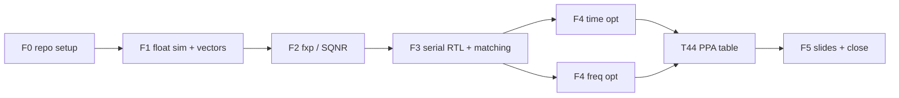
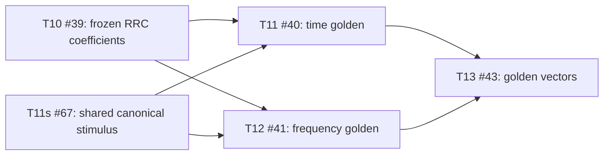
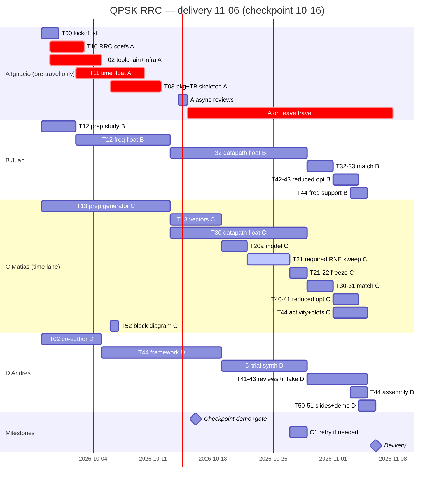

# Plan + Gantt — QPSK RRC time vs frequency (4-person team)

> Planning Project: [QPSK RRC Filter - Plan](https://github.com/users/iledesma08/projects/3). It tracks repository setup and Wayfinder map #1 only.
> Execution Project: [QPSK RRC Filter - Execution](https://github.com/users/iledesma08/projects/4). This document is the live execution plan: milestones, T-tasks with owners and dates, and the by-person Gantt.

## Phases and dependencies

```mermaid
flowchart LR
  F0[F0 repo setup] --> F1[F1 float sim + vectors]
  F1 --> F2[F2 fxp / SQNR]
  F2 --> F3[F3 serial RTL + matching]
  F3 --> F4t[F4 time opt]
  F3 --> F4f[F4 freq opt]
  F4t --> T44[T44 PPA table]
  F4f --> T44
  T44 --> F5[F5 slides + close]
```

```mermaid
flowchart LR
  T10[T10 #39: frozen RRC coefficients] --> T11[T11 #40: time golden]
  T10 --> T12[T12 #41: frequency golden]
  T11s[T11s #67: shared canonical stimulus] --> T11
  T11s --> T12
  T11 --> T13[T13 #43: golden vectors]
  T12 --> T13
```

> T13 is the F1 reference/generator gate, not the completed FXP/RTL vector set. T22 regenerates per-domain integer expectations after numerical acceptance; T31/T33 bind per-variant latency and flush counts. F4 time and F4 freq run in parallel and rejoin at T44.
> T11s (#67) is the shared input prerequisite for T11/T12; T10 remains their separate coefficient prerequisite. T11 and T12 can proceed in parallel once both prerequisites are met.
> Numeric completion chain: `T13 -> T20 -> T21 -> T22 -> T30/T32 completion -> T31/T33`. Structural RTL work can start after T03; integer matching cannot start from a cast of float references or guessed future latency.
> `SQNR-retry` (7d, only if no width hits 40 dB) extends F2; `signoff-respin` (5d) follows T44;
> `professor-gate` (hop-9 approval) is closed (2026-10-06, #74): the revised assignment fixes 50% overlap, so no professor wait precedes F5 sign-off.

- **F1** produces RRC `rrc8-v1` (α=0.5, 8 taps, OS 2x, `D=3.5`), shared stimulus, and float references for `canonical` + 3 `sys_corners` cases. Metadata declares the float-reference stage; no final integer expectations or RTL latencies are claimed. Contracts: #13, #14, #15, schema.
- **F2** validates production `Q2.14` (`W_common=16`) at SQNR ≥ 40 dB in both domains and cross-domain SQNR ≥ 33.98 dB (34 dB nominal) between them, reports the required RNE width frontier, and exports per-domain integer expectations. T20 freezes production FFT-A arithmetic before accepting sweep results. Narrow-guard, FFT-B and truncation/wrap comparisons are optional, not phase gates. Contract: #16.
- **F3** requires 100% exact int-code vector matching in both versions (incl. `sys_corners`, latency/`II`, bubble/stall robustness) before optimizing. Contracts: #17, #14.
- **F4** runs the reduced 6-row matrix (serials + S4/S8 + U4/U8) from one parameterized source, same-SDC/sizing/signoff, VCD/SAIF power, Pareto ranking. Contracts: #18, #19, #2.
- **F5** contrasts PPA + lessons learned + actual vs planned Gantt. AWGN annex #35 stays dormant Python-only, never DoD.

## Milestones (suggested tags)

| Milestone | Criterion | Due | Tag |
| --------- | --------- | --- | --- |
| M1 float golden | green pytest + plots + documented coefs + deterministic float-reference artifacts | 10-19 | `v0.1-float` |
| M2 fixed point | production Q2.14 passes per-domain and cross-domain SQNR/overflow/saturation gates + diagnostic sweep + per-domain integer expectations | 10-29 | `v0.2-fxp` |
| M3 serial | 100% time and freq vector matching | 11-01 | `v0.3-serial` |
| M4 optimized | six architectures at declared main targets + matched-target improvement evidence per domain; comparative runs prioritized by pilot capacity, extra architectures extension-only | 11-05 | `v1.0-opt` |
| M5 close | slides + actual Gantt + demo | 11-06 | `v1.1-close` |

Clocks: serial main targets are SLOW 10 MHz; optimized main targets are FAST 100 MHz. Prepare six architectures x two targets (12 runs, not 12 architectures), execute the six main runs first, and use pilot-measured capacity for comparative runs. A FAST failure is not fulfilled by passing SLOW. Architecture-only deltas and Pareto ranking require matched target/corner/workload/activity.

## Tasks (T) — issue granularity

### F0 — Repo setup + toolchain/infra (pre-absence load for A)

| ID | Task | Comes from | Owner / window |
| -- | ---- | ---------- | -------------- |
| T00 | Organized repo (this pack) + labels + `main` protection | this PR | all |
| T01 | Fill in team table in README + create GitHub Project | T00 | all |
| T02 | Toolchain/infra: `requirements.txt` pins (`toolchain-gap-2.md`), `run.sh` per variant (time/freq serial/opt) plus the top-level `rtl/run.sh`, `iverilog -g2012` + `vvp` nonzero-on-mismatch, Verilator lint-only CI (DUT only), SDC template (`PNR/SIGNOFF` identical except period) + OpenLane JSON skeleton per variant (DUT only, syn-commit rule), per-machine smoke re-verify per `openlane-env-19.md` | T00 | **A+D co-author before 2026-10-05** |
| T03 | Streaming skeleton (no frozen coefs): `rtl/common/rrc_pkg.sv` (`FFT_LEN=16,HOP=8,DISCARD_PREFIX=8,EMIT_START=8,EMIT_LEN=8,DATA_WIDTH/SPC` params), handshake/reset shell (`valid/ready`, async-assert/sync-deassert + 2-flop sync), packed `{Q,I}` + signed casts, manifest-driven TB skeleton (`DATA_WIDTH/SPC/valid_start/valid_len/latency_samples` from manifest, exact int-code compare, bubble/stall scoreboard hooks) per `rtl-streaming-17.md` | T02 | **A before 2026-10-13**; B reviews freq params for professor-gate switch (gate closed, #74) |

> T02/T03 are the front-load: frozen base (infra + package + TB skeleton) that lets B/C/D build datapaths from 10-13 with no A needed.

### F1 — Floating-point simulator (golden)

| ID | Task | Depends on | DoD |
| -- | ---- | ---------- | --- |
| T10 | RRC coefficients α=0.5, 8 taps, OS 2x + generator script per `rrc-coefficient-contract-13.md` D1-D7 | T00 | centered grid `t[n]=(n-3.5)/2`, raw + L2-normalized vector (`sum(h²)=1`), `D=3.5` documented, artifact `rrc8-v1` fields, symmetry/energy/singular-branch checks, stem + `freqz`-4096 + eye plots on natural grid |
| T11s | Shared deterministic canonical stimulus for T11/T12 per `qpsk-stimulus-15.md` D1-D5 | Contract #15 (no issue blocker) | `S=1024`, `default_rng(2026)`, five 8-symbol edge patterns + Gray-mapped tail, `Es=2`, zero-insertion `L=2048`; one reproducible source consumed by both goldens; focused pytest coverage; no coefficients, filtering, or vectors |
| T11 | **Time** float filter consuming the shared stimulus per `qpsk-stimulus-15.md` D1-D8 | T10, T11s | zero initial history, full causal output `2055`, center `2k+3.5`; pytest (length, impulse→taps, time/freq `rtol=1e-10,atol=1e-12`) + folded sample/spectrum plots on natural grid; **A must finish by 2026-10-10 (buffer before absence)** |
| T12 | **Frequency** float filter (forced-50% OLS `N=16,H=8`, discard `z[0:8]`, emit `z[8:16]`) per `frequency-block-contract-14.md` D1 | T10, T11s | consume shared samples `x[8b-8+r]`, 8-zero pre-frame, NumPy `1/N`-once, `I=real,Q=imag`, block cadence 8, 7-check suite (`S=32` OLS/OLA/canonical-H9, impulse, packing round-trip, ~1e-15), no unexplained shift; professor-gate: hop-9 needs approval (gate closed 2026-10-06: the revised assignment fixes 50% overlap, #74) |
| T13 | F1 reference artifacts + staged vector generator (C guards) per `qpsk-stimulus-15.md` + `vector-manifest-schema.md` + ADR-0004 | T11, T12 | deterministic full-length canonical/corner stimulus and float references, stage/domain/provenance and hashes; no invented FXP expected codes or RTL latency; final integer export is T22 and matching metadata is T31/T33 |

### F2 — Fixed point + SQNR (C owns; required RNE sweep and FFT-A validation; extras optional)

| ID | Task | Depends on | DoD |
| -- | ---- | ---------- | --- |
| T20 | Integer FXP models + SQNR per `fxp-policy-16.md` + ADR-0005 | T13 float references | production Q2.14, 35-bit time accumulator, RNE/explicit saturation; freeze FFT schedule, twiddles, H[k], widths, narrowing and total scale with Juan before T21 accepts rows; model actual integer stages, not a final cast of float FFTs; directed checks and overflow/saturation counters |
| T21 | Required width sweep + production Q2.14 validation (SQNR ≥ 40 dB, cross-domain ≥ 33.98 dB) | T20 numeric freeze | RNE at W=8,10,12,14,16,18 with conservative guards and frequency A; split-half stability and precision frontier; W=16 passes both domains with zero overflow/canonical saturation; cross-domain SQNR between time and frequency FXP outputs ≥ 33.98 dB (34 dB nominal) on canonical, reported for `sys_corners` (ADR-0005 amendment, #74); optional diagnostics are not blockers; production-format changes require a recorded decision |
| T22 | Export validated production coefficients and integer expectations | T21 | Q2.14 coefficient table + provenance; regenerate input and per-domain expected codes from accepted FXP models for canonical/corners; F2 stage manifest/hashes without guessed RTL latency; unblocks final F3 integration |

### F3 — Serial RTL + vector matching (structural work after T03, integer integration after T22)

| ID | Task | Depends on | DoD |
| -- | ---- | ---------- | --- |
| T30 | Serial **time** RTL (1 MAC / sample, `S=1,II=8`) | T03 to start; T22 for completion | Q2.14 interface, accepted-sample history, signed full-precision arithmetic and frozen casts; valid/ready/reset/packing; final numeric integration consumes validated production artifacts |
| T31 | Per-variant metadata + **time** matching | T30, T22 | exact own-domain integer matching (canonical/corners), measured latency/II and scoreboard robustness; 7 accepted flush zeros at SPC=1, 2055 raw/compared outputs; wider beat padding counted separately; bounded drain/no loss/no extra outputs |
| T32 | Serial **frequency** RTL (`U=1`) | T03 to start; T22 for completion | same interface discipline, T20-frozen integer FFT arithmetic and parameterized block engine; zero history internally; canonical 257-block schedule including 8 accepted flush zeros at SPC=1 |
| T33 | Per-variant metadata + **frequency** matching | T32, T22 | exact own-domain matching and latency/II/robustness gates; 2056 raw outputs, exactly 2055 compared; final block-padding output declared; bounded drain and target-period activity |

### F4 — Optimized RTL (reduced 6-row matrix for 11-06; full 12-row on extension — C=time rows, B=freq rows, D=table)

> Reduced matrix for 11-06: serials + `T-S4P1`/`T-S8P1` + `F-U4`/`F-U8`. Full 12-row matrix (with `P=2`, `U2`, folded) only on extension — per the contract #18 amendment (6-row baseline decided 2026-09-25).
> All variants from one parameterized source, bit-exact (same rounding/sat/widths); `II=8/S` (time), `II` measured from handshake.

| ID | Task | Depends on | DoD |
| -- | ---- | ---------- | --- |
| T40 | Opt **time** RTL: `T-S4P1,S8P1` (reduced for 11-06; full factorial on extension) | T31 | ordinary signed arithmetic and one validated fixed-coefficient path; exact matching of both rows; P=1 realizability without numeric change; Booth and alternate ROM comparisons optional; P=2 only on extension |
| T41 | Target-specific synthesis/timing/activity **time** | T40 (optimized), T31 (serial) | T-serial SLOW 10 MHz main, S4P1/S8P1 FAST 100 MHz main; prepare both targets, record failed/unrun results; pilot-prioritized comparative runs; retain reports, physical signoff, actual-period activity, matched-target serial deltas |
| T42 | Opt **frequency** RTL: `F-U4,U8` (reduced for 11-06; U2/folded on extension) | T33 | vector matching + same source/bit-exact rule; `U=8` = full radix-2 butterfly parallelism |
| T43 | Target-specific synthesis/timing/activity **frequency** | T42 (optimized), T33 (serial) | F-serial SLOW 10 MHz main, U4/U8 FAST 100 MHz main; same paired-run/evidence rules as T41; activity covers all 257 blocks |
| T44 | PPA comparison for six base architectures (D owns; B/C synth, C activity) | T41, T43 | main-goal status and paired-run ledger; gated Pareto/deltas at matched target/corner/workload; each candidate reports improvement or regression vs own-domain serial; at least one improved axis from an optimized candidate per domain, not all axes/all variants; failed/not-comparable/unrun evidence remains explicit |

> D3 interpretation: SLOW and FAST are declared target classes, not failure labels. A FAST failure remains a failed FAST goal even if its SLOW run passes. T44 compares only compatible evidence at the same target and does not attribute mixed-target gains to architecture alone.

### Delivered scope for 11-06 (decided 2026-09-25; checkpoint confirms progress)

Delivery 11-06 covers these six architectures. Architecture count is separate
from physical run count: prepare both 10 MHz and 100 MHz runs for each, execute
the six main objectives first, and prioritize matched-target comparative
evidence using the first real pilot. Extra clock runs do not activate the
twelve-architecture extension or relax any failed FAST goal.

| Keep | Why it stays |
| ---- | ------------ |
| T-serial (`S=1,P=1`) | Area/timing/throughput reference; every comparison needs it |
| T-S4P1 | Mid systolic scaling point |
| T-S8P1 | Full tap array; S4→S8 reads systolic scaling at fixed `P` |
| F-serial (`U=1`) | Frequency reference; same role as T-serial |
| F-U4 | Mid replication point |
| F-U8 | Full radix-2 butterfly parallelism; U4→U8 reads replication scaling |

| Architecture | Main goal | Comparative target |
| --- | --- | --- |
| T-serial, F-serial | SLOW 10 MHz | 100 MHz |
| T-S4P1, T-S8P1, F-U4, F-U8 | FAST 100 MHz | 10 MHz |

T41/T43 retain both run inputs and statuses, including unrun/failed entries.
At least one matched-target serial/optimized comparison per domain is needed
to substantiate the required improvement; an unrun secondary configuration
does not supply that evidence. Do not infer pilot capacity from the short
toolchain smoke test or promise all twelve physical runs without measuring it.

| Cut for 11-06 | Why it is the cheapest loss | Returns on extension |
| ------------- | --------------------------- | -------------------- |
| T-S2P1 | Low-parallelism trend readable from S4/S8 without it | yes |
| T-S2P2, T-S4P2, T-S8P2 | Additional pipeline-depth (`P=2`) comparisons; the base retains registered `P=1` arithmetic and systolic scaling | yes |
| F-U2 | Low replication trend readable from U4/U8 without it | yes |
| F-F2 (folded) | Measured folding contrast is deferred; any qualitative discussion in slides must not imply a measured result | yes |

Rules: this 6-row scope is decided (contract #18 amendment, 6-row baseline), not pending. The 10-16 checkpoint confirms progress and is the venue to request the extension (then: the full 12-row matrix resumes); otherwise the 6-row delivery stands. No matrix/RTL fork for cut rows without the extension; every datapath stays parameterized so cut rows come back by configuration, not redesign.

### Base, optional experiments and excluded work (accepted 2026-10-02)

| Level | Scope | Gate effect |
| --- | --- | --- |
| Required base | Production Q2.14/RNE, conservative 35-bit time accumulator, FFT A, required width sweep, one fixed-coefficient path, six architectures, matching/reset/handshake/flush and comparable PPA/slides/Gantt evidence | Required for phase/delivery completion. |
| Optional experiments | Custom Booth, alternate ROM comparison, 33/34-bit accumulators, FFT B, truncation/wrap controls | Take only with capacity and base evidence; never block M2-M4 or create a new ranked base row. Any production adoption is a separate recorded change. |
| Outside base | Extra S2/P2/U2/folded architectures, Q1.15 coefficient sensitivity, AWGN/BER/full-link analysis, writable taps, full AXI or new board-demo requirements | Explicit scope activation required; extra matrix architectures remain extension-only. An extension does not automatically activate all other extras. |

Optional arithmetic/ROM work does not remove required signedness, RNE,
overflow/saturation checks, fixed-coefficient correctness or TB `$readmemh`
vector loading. A single correct path suffices; if alternatives are actually
implemented, test their equivalence and report them separately from the base.

### F5 — Slides + close

| ID | Task | Depends on | DoD |
| -- | ---- | ---------- | --- |
| T50 | Slides: contrast + PPA + lessons learned | T44 | PDF in `docs/slides/` (D assembles; technical plots delivered by C by 11-04); evidence per `ppa-matrix-18.md` (taps/response, SQNR, EVM vs float golden, constellation, eye/zero-ISI on canonical frame) + dormant `link-awgn-annex-35.md` if built (dual-arm float vs FXP-at-`W_common`, ideal/long TX ±8 sym — never 8-tap, `Es=2`, seed 2035, labelled interp, ideal-sync list, ≥100 errors/point, `Q(sqrt(Es/N0))`, loss at ref BER; no `vectors/rtl/tb` touch, never DoD) |
| T51 | Actual vs planned Gantt + final demo | T50 | this table updated + `v1.1-close` tag |
| T52 | System block diagram + stage descriptions (`docs/block-diagram.md`), required by the revised assignment | Accepted contracts; revisit after T42 | Mermaid system/verification, time and frequency views; per-stage function, parameters and source matching contracts and code; linked from README, AGENTS and slides; updated when T42 fixes the optimized frequency architecture |

The T-task taxonomy above is the live execution plan. It is instantiated as issues #38–#60 plus shared prerequisite #67 and T52 (#76) (sub-issues of map #12, owners, milestones M1–M5, native blocking); lazy sub-issues (per-row F4 splits, per-width sweep splits) are added only when their fog graduates.

## Initial 4-way split (delivery 11-06; travel 10-15→11-08; C takes the time lane)

| Person | Member | Main lane | Responsibility |
| ------ | ------ | --------- | -------------- |
| A | Ignacio (`iledesma08`) | Pre-travel implementation (no delivery tasks) | **09-28→10-14:** T10 (09-29→10-02) + T02 (09-29→10-04) + T11s (#67 shared stimulus, prerequisite to T11/T12) + T11 (10-02→10-10) + T03 (10-06→10-12) + async reviews (T20a plan + C time-datapath plan, 10-14); **travel 10-15→11-08:** available for meetings via Zoom, but no implementation or delivery dependency on A |
| B | Juan (`JRondon23`) | Frequency lane + checkpoint co-presenter | **09-28→10-13:** T12 prep + T12 golden (needs frozen T10 and shared T11s); **10-13→10-29:** freq datapath + TB vs float (parameterized W); **10-29→11-01:** coef integration + 100% match; **11-01→11-04:** reduced opt (U4/U8) + closure; **11-03→11-05:** freq synth support for T44 |
| C | Matias (`matiascostamagna`) | Transversal + TIME lane (hottest lane — 1d stall rule) | **09-28→10-13:** T13 prep + review of T10/T11; **10-13→10-19:** T13 references; **10-13→10-29:** structural time RTL (parallel with F2); **10-19→10-29:** T20→T21→T22 (required RNE sweep, conservative guards, FFT A); **10-29→11-01:** integer integration + matching; **11-01→11-04:** base S4P1/S8P1 + closure; **11-01→11-05:** activity + plots + vector guard; optional experiments do not consume mandatory critical-path slots |
| D | Andres (`AndresCesana`) | PPA + close + checkpoint organizer | **09-28→10-05:** T02 co-author (JSON/SDC skeletons, A reviews) + smoke all machines; **10-05→10-19:** T44 framework + intake pipeline + slides outline; **10-19→10-29:** trial synth of both datapaths (de-risks closure); **10-29→11-05:** per-row reviews + incremental intake; **11-03→11-06:** T44 assembly + T50/T51 slides + demo + rehearsal |

Rules:

- Nobody merges their own PR (cross-review A↔B, C↔D).
- C guards `sim/vectors/` (only one who regenerates).
- B/C lanes: each lane owner runs their own synthesis (C: time lane, B: freq lane); C operates the shared activity-run pipeline producing one VCD/SAIF per row for every candidate; D owns the compared 6-row PPA table (T44) and checks same-target/activity status.
- D keeps this table and the slides up to date.
- If a lane stalls for >2 days, ask for help and move an issue (leave a comment as record).
- Crunch cadence 10-27→11-06: daily 15-min standup for B/C/D; A may join via Zoom during travel. The 1d stall rule applies to everyone in that window, replacing the 2d rule above (C keeps 1d throughout its triple stream).
- A is unavailable for implementation from 2026-10-15 through 2026-11-08 but remains available for meetings via Zoom, including the checkpoint. Handoff rule: A must leave `T10+T11+T02+T03` green on `main` (or PR ready) by 2026-10-13; A reviews the T20a plan and C's time-datapath plan async on 2026-10-14. No implementation or delivery gate may depend on A after 10-14.
- B/C/D work from frozen A outputs (`rrc8-v1` artifact, time golden, `rrc_pkg`/TB skeleton); C owns the time lane from 10-13 and B/C/D prepare and present the checkpoint. A may advise remotely; B/C/D can proceed and record decisions without waiting for A.

## Estimated Gantt (delivery Fri 2026-11-06; checkpoint Fri 2026-10-16)

> **How to read:** each `section` is one person. Delivery 11-06, checkpoint 10-16. A implements only pre-travel; C carries transversal + time lane. The six-row base is already decided; the checkpoint reviews progress and whether a deadline extension is needed.
> Mermaid colors (GitHub-limited): `crit` = **red** (pre-travel/pre-checkpoint critical + leave gap), `active` = **blue** (sweep crunch), unmarked = **normal**, `milestone` = diamond.
> Every bar names the T-task it implements; the legend below details input, output, and owner.

```mermaid
gantt
  title QPSK RRC — delivery 11-06 (checkpoint 10-16)
  dateFormat YYYY-MM-DD
  section A Ignacio (pre-travel only)
  T00 kickoff all       :2026-09-28, 2d
  T10 RRC coefs A       :crit, 2026-09-29, 4d
  T02 toolchain+infra A :crit, 2026-09-29, 6d
  T11 time float A      :crit, 2026-10-02, 8d
  T03 pkg+TB skeleton A :crit, 2026-10-06, 6d
  A async reviews       :2026-10-14, 1d
  A on leave travel     :crit, 2026-10-15, 24d
  section B Juan
  T12 prep study B      :2026-09-28, 4d
  T12 freq float B      :2026-10-02, 11d
  T32 datapath float B  :2026-10-13, 16d
  T32-33 match B        :2026-10-29, 3d
  T42-43 reduced opt B  :2026-11-01, 3d
  T44 freq support B    :2026-11-03, 2d
  section C Matias (time lane)
  T13 prep generator C  :2026-09-28, 15d
  T13 vectors C         :2026-10-13, 6d
  T30 datapath float C  :2026-10-13, 16d
  T20a model C          :2026-10-19, 3d
  T21 required RNE sweep C :active, 2026-10-22, 5d
  T21-22 freeze C       :2026-10-27, 2d
  T30-31 match C        :2026-10-29, 3d
  T40-41 reduced opt C  :2026-11-01, 3d
  T44 activity+plots C  :2026-11-01, 4d
  T52 block diagram C   :2026-10-06, 1d
  section D Andres
  T02 co-author D       :2026-09-28, 7d
  T44 framework D       :2026-10-05, 14d
  D trial synth D       :2026-10-19, 10d
  T41-43 reviews+intake D :2026-10-29, 7d
  T44 assembly D        :2026-11-03, 2d
  T50-51 slides+demo D  :2026-11-04, 2d
  section Milestones
  Checkpoint demo+gate   :milestone, 2026-10-16, 0d
  C1 retry if needed    :2026-10-27, 2d
  Delivery              :milestone, 2026-11-06, 0d
```

> Project start Mon 2026-09-28. A leaves frozen `rrc8-v1`, time golden, and skeletons by 10-13 (red) + async reviews 10-14. Checkpoint 10-16 demos goldens + T13 progress + revised plan. Structural RTL work starts 10-13; complete integer arithmetic is checked once T20 is available. Q2.14 evidence and expected codes freeze 10-29; serials match by 11-01; six-architecture PPA + slides target 11-06.
> Delivery Fri 2026-11-06; checkpoint Fri 2026-10-16 (progress review and possible deadline extension, not ratification of the already-decided six-row base).
> If the extension is granted, the F4–F5 block stretches while keeping dependency order.

### What each bar means

**A Ignacio**: implementation before travel; available for meetings via Zoom during travel, with no delivery dependency on that availability.
- `T00 kickoff all` (09-28, 2d): repo + project setup with everyone.
- `T10 RRC coefficients` (09-29, 4d): `rrc8-v1` grid, values, unit-energy normalization, artifact, plots. Output unblocks `T11`/`T12`.
- `T02 toolchain+infra` (09-29, 6d): pins, per-variant `run.sh` + top-level, lint CI, SDC template, OpenLane JSON skeletons, per-machine smoke. Output unblocks every lane.
- `T11 time float golden` (10-02, 8d): 1024-symbol frame, edge patterns, zero insertion, full 2055-sample golden + checks. Must finish 10-10 as handoff buffer.
- `T03 pkg+TB skeleton` (10-06, 6d): package with block params, handshake/reset shell, manifest-driven TB skeleton without frozen coefs. Output lets B/C/D work during the absence.
- `A async reviews` (10-14, 1d): review the T20a plan and C's time-datapath plan the day before travel.
- `A on leave travel` (10-15, 24d): no implementation during travel; A may attend meetings via Zoom. The delivery plan does not wait for A's return.

**B Juan** — steady frequency lane; checkpoint co-presenter.
- `T12 prep contract study` (09-28, 4d): study #13/#14/#17, set up the freq sim harness. Input: draft `T10`. Output: ready harness.
- `T12 freq float golden` (10-02, 11d): forced-50% OLS float model + 7-check suite. Input: frozen `T10` and shared `T11s`.
- `T32 datapath float` (10-13, 16d): structural FFT engine, scheduler and stream/block checks using T03/T12; integrate the actual frozen integer arithmetic with Matias when T20 is available. Float checks diagnose algorithm/alignment but do not prove bit-exact FXP behavior.
- `T32-33 match` (10-29, 3d): integrate T22 expected codes and per-variant metadata, then exact own-domain matching, flush/drain counts, latency and robustness. The three-day window is an estimate, not guaranteed by previous float checks.
- `T42-43 reduced opt` (11-01, 3d): `F-U4`/`F-U8` + closure (U2/folded on extension).
- `T44 freq support` (11-03, 2d): synth runs feeding D's incremental assembly.

**C Matias** — transversal + time lane (hottest lane, 1d stall rule).
- `T13 prep generator` (09-28, 15d): generator skeleton + review of `T10`/`T11` drafts.
- `T13 golden vectors` (10-13, 6d): generator and deterministic canonical/corner float-reference stage, with provenance/hashes. It does not require final integer expected codes or a future RTL latency.
- `T30 datapath float` (10-13, 16d): structural time datapath/controller and algorithm checks, then T20-frozen integer operations. Float agreement is not exact integer matching. A's 10-14 review concerns the design plan, not future measured evidence.
- `T20a model` (10-19, 3d): actual integer FXP models + SQNR + directed/tie checks; numeric FFT schedule/rounding freeze coordinated with Juan. Placeholder source files do not establish completion or prove this duration sufficient.
- `T21 required RNE sweep` (10-22, 5d, blue): required width/SQNR frontier and Q2.14 validation using conservative guards and FFT A, plus split-half, overflow/saturation and cross-domain SQNR evidence. Truncation/wrap, narrow guards and FFT B do not block this slot.
- `T21-22 freeze` (10-27, 2d): accept Q2.14 numerical evidence, report the diagnostic width frontier, and generate final per-domain integer expected codes. Failure of W=16 cannot be hidden by another width passing.
- `T30-31 match` (10-29, 3d): final integer integration plus exact matching, measured metadata, flush counts, drain and robustness; previous float checks are not substitutes for these gates.
- `T40-41 reduced opt` (11-01, 3d): `T-S4P1`/`T-S8P1` + closure.
- `T44 activity+plots` (11-01, 4d): one VCD/SAIF per row as rows close + evidence plots by 11-04 + vector guard.
- `T52 block diagram` (10-06, 1d): candidate system block diagram and stage descriptions for team review; revisited when T42 fixes the optimized frequency architecture.

**D Andres** — PPA + close; checkpoint organizer.
- `T02 co-author` (09-28, 7d): OpenLane JSON/SDC skeletons (A reviews) + smoke all machines.
- `T44 framework` (10-05, 14d): table template with auto-fill intake, slides outline from day one.
- `D trial synth` (10-19, 10d): early synthesis and first real physical pilot as a verified candidate becomes available. Measure run capacity and prepare main/secondary target automation; smoke-only or unverified-core numbers are not final PPA evidence.
- `T41-43 reviews+intake` (10-29, 7d): review target-specific timing/activity and incremental intake; prioritize comparative runs that establish same-target serial deltas per domain, then remaining target pairs if capacity permits.
- `T44 assembly` (11-03, 2d): assembly-from-filled-template + Pareto defense.
- `T50-51 slides+demo` (11-04, 2d): assembly on plots arriving from C by 11-04 + demo + rehearsal from the draft table.

**Milestones + gate**: `Checkpoint demo+gate` (10-16, prepared by B/C/D; A may join via Zoom): frozen set T10+T11+T12+T02/T03 + T13 progress + revised plan; reviews progress and whether an extension is needed. The six-row base is already accepted. `C1 retry` (10-27, 2d, conditional): consumes the freeze buffer; if triggered, emergency scope call with the professor. `Delivery` (11-06): slides + demo + tag.

**Travel + zero-slack audit:** implementation and delivery after 10-14 do not depend on A; remote meeting participation is supported. The plan has zero slack: any >1d slip before 10-29 consumes the freeze buffer; any slip after 10-29 requires an explicit recovery decision (scope change or extension), not automatic activation of additional rows. C's 10-13→10-29 triple stream is the hottest spot (1d stall rule, D absorbs plots/activity as backup).

### Couplings: where the Gantt is truly parallel vs gated

Truly parallel (no shared gate): B vs C lanes from 10-13 (same T03 skeleton, separate lanes); D vs everyone (framework, trial synth, outline consume only frozen outputs); all three prep streams from day one.

| # | Coupling | Window | Slack / shock absorber |
|---|----------|--------|------------------------|
| 1 | A→all: T03 + T11 frozen | until 10-13 | Handoff 10-13 + async reviews 10-14; single supplier, thin but sufficient buffer |
| 2 | T20 numeric freeze + T22 expectations gate final matching | 10-19→11-01 | Structural RTL can proceed earlier; exact arithmetic must agree with T20. Float checks cannot guarantee that only the coefficient table changes at integration. |
| 3 | Opt rows → D assembly + C plots | 11-03→11-05 | Incremental intake from 10-29; serial/FXP plots advanceable, only opt-row EVM arrives last; zero slack regardless |
| 4 | Checkpoint set frozen 10-15 | 10-15→10-16 | Set completes 10-12/10-13 by plan: 2–3d of air |
| 5 | T11s (#67) → T11/T12 shared input | Before T11/T12 integration | One deterministic source unblocks both lanes; T10 remains an independent coefficient dependency |

Non-issues: machine contention (all four run Nix/OpenLane locally per #19 — no shared runner); C's triple stream is load, not a dependency, with priority T13 > freeze > datapath-finish and D absorbing plots/activity as backup.

## Risks

| Risk | Mitigation |
| ---- | ---------- |
| FFT/IFFT does not match time | T12 forced-50% schedule + 7-check suite (`rtol=1e-10,atol=1e-12`) from day 1; no unexplained shift |
| Production Q2.14 fails numerical gates | Retain the diagnostic sweep, correct internal arithmetic/scaling and repeat evidence; any external-format change is a recorded decision, never automatic widening or lower SQNR. |
| FAST 100 MHz timing does not close | Record failed FAST goal; a successful secondary SLOW run does not fulfill it. Request early review and explicit recovery; matched-target evidence only. |
| Vectors edited by hand / manifest drift | `sim/vectors/README` + CONTRIBUTING + per-file `.sha256` CI gate; TB reads manifest, never hardcodes; C is sole regenerator |
| Professor gate (hop-9) | Closed 2026-10-06 (#74): the revised assignment fixes 50% overlap, so hop 8 is final and no proposal is sent; hop params stay parameterized |
| PPA run capacity | Six architectures, twelve prepared target runs: main objectives first, matched-target improvement evidence next, remaining pairs by measured pilot capacity. Extra architectures remain extension-only. |
| D end-funnel (table+slides pile up Nov04) | Incremental intake from 10-29, C plots by 11-04, assembly-from-template 11-03; rehearsal starts on a draft table, never on empty docs |
| Power ranked without activity | VCD/SAIF full-257 per candidate; unannotated = estimate, excluded from dynamic ranking |
| A unavailable for implementation (travel 10-15–11-08) | Handoff green by 10-13 + async reviews 10-14; checkpoint demo frozen 10-15 by B/C/D; A may attend via Zoom but delivery scope needs no A by construction |
| Zero slack to 11-06 | Any >1d slip before 10-29 eats the freeze buffer; after 10-29 it requires an explicitly agreed scope change or extension |
| Reduced matrix scope | Decided 6-row base (contract #18 amendment); checkpoint is a progress gate + extension venue, not a scope decision |
| C triple-stream 10-13→10-29 | 1d stall rule on the C lane; D absorbs plots/activity early as backup; datapath pre-verified vs float de-risks matching |
| 3d serial match | Requires actual integer-model alignment before integration. Float prechecks do not guarantee bit-exactness; report arithmetic/flush/drain slips immediately rather than assuming a table-only swap. |
| One lane races ahead | Weekly cross-reviews + actual Gantt in T51 |
